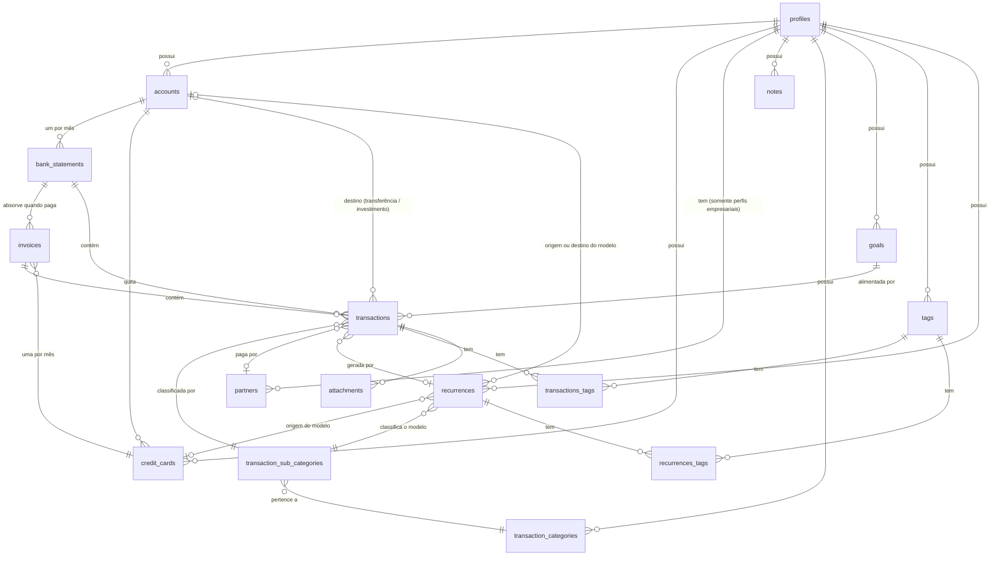

# Design do Banco de Dados

**Status:** Design concluído — motor escolhido (SQLite), contrato físico especificado
(tipos, restrições, ações de chave estrangeira, índices).
**DDL:** [db/migrations/0001_initial_schema.sql](../../db/migrations/0001_initial_schema.sql)
— uma transcrição da §4; validada contra o SQLite 3.46 — e as migrations seguintes em
[db/migrations/](../../db/migrations/) ([§6](#6-próximos-passos)).
**Fonte da verdade visual:** [docs/drawio/project.drawio](../drawio/project.drawio)
**Sincronização:** [docs/plans/sync-design.md](sync-design.md) — como este schema é
replicado entre dispositivos.
**Backend:** [docs/plans/backend-design.md](backend-design.md) — o núcleo que lê e
escreve este schema, e como ele evolui por migrations.

Este documento é o lugar de toda decisão de banco de dados do projeto. O arquivo draw.io
guarda a imagem; este arquivo guarda o raciocínio e os contratos dos atributos. Quando
os dois divergirem, atualize ambos — nenhum dos dois pode ficar para trás.

Como ler: a [§3](#3-convenções) reúne as regras que valem para todas as tabelas. A
[§4](#4-tabelas) descreve cada tabela por completo — o que ela é, as decisões tomadas
sobre ela, suas colunas, chaves estrangeiras e índices. A DDL é uma transcrição da §4
sob as regras da §3; quando as duas divergirem, uma delas está errada e ambas são
corrigidas.

---

## 1. Escopo

O modelo cobre todo o domínio descrito no [README](../../README.md): perfis, contas,
cartões de crédito, consolidações mensais (extratos bancários e faturas de cartão),
transações com sua classificação, além das entidades de apoio (sócios, tags,
recorrências, anexos, metas, notas).

Ele **ainda não** cobre a proveniência da importação do histórico de transações que está
sendo migrado do app atual ([§6 Próximos passos](#6-próximos-passos)). A sincronização
entre dispositivos está projetada em [sync-design.md](sync-design.md); seus metadados
ficam em tabelas separadas e não alteram as tabelas abaixo.

---

## 2. Visão geral das relações entre entidades



---

## 3. Convenções

Regras que valem para todas as tabelas. Nada aqui é repetido na [§4](#4-tabelas).

### 3.1 Motor de armazenamento — SQLite

**SQLite**, como um único arquivo de banco de dados no dispositivo do usuário.

**Por quê:** as quatro restrições herdadas do [README](../../README.md) — embarcado,
gratuito para sempre, roda no desktop *e* no mobile, não impede uma sincronização
futura — eliminam quase todo o resto, e o SQLite é mais forte justamente nas duas que
mais importam aqui:

- **Ele já está em todas as plataformas mobile.** Android e iOS já vêm com SQLite, e
  todo caminho mobile plausível chega até ele. Como a tecnologia mobile está
  explicitamente indefinida, o motor precisa ser a parte da stack que sobrevive a
  qualquer escolha feita depois.
- **Relatórios são a razão de ser deste projeto**, e eles são relacionais e orientados
  a mês. Window functions, CTEs, índices parciais e de expressão vêm de graça, então
  saldos acumulados e comparações mês a mês são consultas comuns, e não código de
  aplicação.
- **A propriedade dos dados passa a ser literal** — um arquivo que o usuário pode
  copiar, fazer backup e abrir com qualquer uma de centenas de ferramentas daqui a
  trinta anos. O formato de arquivo do SQLite carrega um compromisso público de
  continuar legível por décadas, que é o horizonte certo para um arquivo financeiro.
- **Check constraints, índices parciais e ações `ON DELETE`** permitem que as regras
  abaixo sejam garantidas pelo banco em vez de por convenção, e **`REAL` é um double
  IEEE-754**, exatamente o que a [§3.7](#37-dinheiro) pede.

**Alternativas consideradas e rejeitadas:**

| Opção | Por que não |
|---|---|
| PostgreSQL / MySQL | Exigem um servidor sempre ligado. Falham de cara nas restrições de zero infraestrutura e zero custo. |
| DuckDB | Excelente na metade analítica, mas é OLAP — ruim para as muitas escritas pequenas do lançamento diário de transações, e seu suporte a mobile é fraco. Vale revisitar *junto* com o SQLite para relatórios pesados no desktop, já que o DuckDB consegue consultar um arquivo SQLite diretamente. Não é o armazenamento principal. |
| Document stores (PouchDB/RxDB, estilo CouchDB) | A sincronização vem embutida, o que é tentador, mas eles tornam bem mais difíceis as agregações relacionais orientadas a mês que este projeto existe para produzir. Troca errada. |
| Realm / Atlas Device Sync | Descontinuado pela MongoDB. Um beco sem saída, independentemente dos méritos. |
| libSQL / Turso | Compatível com SQLite e com sincronização embutida, mas a metade da sincronização puxa para um serviço hospedado e, portanto, para um custo recorrente. Rejeitado *por enquanto* — e, por ser compatível com SQLite, ficar no SQLite puro mantém essa opção disponível no futuro sem custo de migração. |

### 3.2 A configuração da conexão faz parte do contrato do schema

Dois pragmas devem ser definidos em **toda** conexão, e nenhum deles aparece na DDL:

- **`PRAGMA foreign_keys = ON`** — o SQLite vem com chaves estrangeiras *desligadas por
  padrão*, por compatibilidade retroativa. Sem isso, toda ação `ON DELETE` do schema
  silenciosamente não faz nada, e a regra de que excluir um perfil remove tudo que está
  abaixo dele
  ([§3.8](#38-o-perfil-é-a-raiz-do-tenant-e-as-chaves-estrangeiras-seguem-o-relacionamento))
  falha em silêncio enquanto parece funcionar.
- **`PRAGMA journal_mode = WAL`** — melhor concorrência e resiliência a falhas. Definido
  uma vez; persiste no arquivo.

A configuração da conexão pertence a um único lugar na camada Repository, pelo qual toda
conexão passa, e não espalhada pelos pontos de chamada. Ela merece um teste que verifique
que um cascade de fato cascateia — o modo de falha é silencioso, e falhas silenciosas na
semântica de exclusão perdem dados.

### 3.3 A camada Repository abstrai o driver, não apenas o banco

A camada Repository já é a única camada que conversa com o banco
([README](../../README.md)). Além disso, ela é escrita contra uma **porta interna
estreita** — execute, query, transaction — com um adaptador específico de plataforma por
trás, em vez de importar um driver SQLite diretamente.

**Por quê:** o motor e o schema são os mesmos em todo lugar, mas *o driver não é*. O
desktop sob Electron usa um módulo nativo do Node; um shell mobile — seja qual for o
escolhido — usa um binding SQLite totalmente diferente, com outra API. O SQL é portável
entre eles; a biblioteca cliente não. Sem a porta, essa diferença vaza para todos os
repositórios e o objetivo de "um único backend para desktop e mobile" falha exatamente
na camada onde deveria ser resolvido.

**Consequência:** as strings SQL e o schema continuam compartilhados; só um adaptador
fino é escrito por plataforma. A camada Repository passa a ser testável contra um banco
em memória, sem nenhuma plataforma envolvida. Outras três traduções vivem nessa mesma
fronteira e em nenhum outro lugar: a caixa dos identificadores ([§3.4](#34-nomenclatura)),
o carimbo de `updated_at` ([§3.6](#36-colunas-presentes-em-todas-as-tabelas)) e a
normalização de caixa dos UUIDs ([§3.5](#35-chaves-primárias-são-uuids)). Se qualquer
uma delas aparecer em dois lugares, é um bug.

### 3.4 Nomenclatura

**Nomes de tabela ficam no plural** — `profiles`, `accounts`, `credit_cards`,
`transactions`. Uma tabela guarda muitas linhas, então o plural lê corretamente no ponto
de uso (`SELECT ... FROM transactions`). A convenção específica importa muito menos do
que ter exatamente uma. O plural vai no **substantivo principal**: uma categoria *de*
transações é `transaction_categories`, não `categories_transaction`. Tabelas de junção
seguem os dois lados: `transactions_tags`. As classes do modelo de domínio continuam no
singular — `Transaction`, `Account` — porque um objeto é uma linha, e o mapeamento
tabela↔classe é uma remoção mecânica do plural.

**Identificadores físicos são `snake_case`** — tabelas, colunas, índices, restrições. O
TypeScript mantém `camelCase`, e a camada Repository traduz entre os dois. O SQLite
preserva `camelCase` de verdade, então isso não é imposto; é uma escolha, porque toda
ferramenta SQL e todo humano que abre o arquivo à mão esperam `snake_case`, porque é
imune, a custo zero, aos problemas de normalização de identificadores de outros motores,
e porque um nome de coluna idêntico byte a byte a uma propriedade do domínio solda o
modelo de domínio ao schema de armazenamento. Um mapeamento explícito é evidência da
fronteira, não overhead. Duas colunas foram renomeadas com base nisso: `limit` →
`limit_value` (palavra-chave do SQLite) e `goals.date` → `target_date` (legibilidade).

**Colunas de chave estrangeira** se chamam `<parent_singular>_id`. **Índices** são
`idx_<table>_<columns>` quando simples e `uq_<table>_<columns>` quando únicos.
**Restrições** também têm nome — `ck_<table>_<column>` para checks,
`fk_<table>_<column>` para chaves estrangeiras — para que uma violação informe *qual*
regra falhou (`CHECK constraint failed: ck_profiles_currency`) em vez de repetir a
expressão.

### 3.5 Chaves primárias são UUIDs

Toda tabela tem `id TEXT NOT NULL PRIMARY KEY CHECK (length(id) = 36)` — uma chave
substituta UUID, nunca um inteiro autoincremental.

**Por quê:** o README mantém a sincronização entre dispositivos aberta como direção
futura, e chaves autoincrementais tornam isso consideravelmente mais difícil — dois
dispositivos offline ao mesmo tempo vão ambos gerar o id `47` para registros diferentes,
e reconciliar isso significa reescrever as chaves e toda chave estrangeira que aponta
para elas. UUIDs permitem que qualquer dispositivo crie um registro a qualquer momento,
offline, sem coordenação e sem colisão.

**Consequência:**

- **Versão 4 (aleatória)**, gerada pela fonte de aleatoriedade segura da plataforma por
  meio da porta `IdGenerator`
  ([backend-design.md §3.4](backend-design.md#34-o-núcleo-só-enxerga-portas)) — sem
  relógio, sem monotonicidade para acertar. O `crypto.randomUUID()` serve no desktop,
  mas o React Native não o oferece, por isso a geração é uma porta. Um UUID ordenado por
  tempo (v7) foi considerado pela localidade no índice e rejeitado: na escala deste
  projeto — dezenas de milhares de linhas — a diferença é imensurável, nada ordena pela
  chave (toda consulta cronológica ordena por `due_date`), e a única propriedade sendo
  comprada é a criação sem colisão em dois dispositivos offline, que o v4 já garante.
- **Exceto linhas identificadas pelo conteúdo, que recebem uma versão 5 determinística**
  — um hash de um namespace fixo da aplicação e da chave natural da linha:
  `bank_statements` e `invoices` (dono, ano, mês), transações emitidas por uma
  recorrência (`recurrence_id`, número da ocorrência), pares de `transactions_tags` e de `recurrences_tags` e dados
  padrão semeados no primeiro uso. Dois dispositivos offline criando "o extrato de
  março" derivam então o mesmo id, e a sincronização mescla uma única linha em vez de
  colidir em um índice único parcial. Recriar uma linha desse tipo que sofreu soft
  delete, portanto, a **revive** em vez de inserir. A regra vale desde a primeira linha
  de código, com ou sem sincronização — adotá-la depois que já existem dados significa
  reescrever chaves. Raciocínio completo em
  [sync-design.md §5.6](sync-design.md#56-linhas-identificadas-pelo-conteúdo-recebem-ids-determinísticos).
- **Quem gera os ids é a aplicação, não o banco.** A camada Service pode montar um grafo
  de objetos completo, ids incluídos, antes de qualquer coisa tocar o Repository, e o
  Repository o grava começando pelos pais, em uma única transação.
- **Armazenados como `TEXT`**, na forma canônica de 36 caracteres, minúscula e com
  hífens. Um `BLOB` de 16 bytes tem metade do tamanho, mas nesta escala a diferença é
  desprezível, e chaves legíveis facilitam muito a depuração e a inspeção manual do
  arquivo. A fronteira do Repository normaliza a caixa, já que o SQLite compara chaves
  byte a byte.
- **Tabelas rowid comuns**, não `WITHOUT ROWID`. A segunda busca economizada é
  imensurável aqui, e tabelas rowid são o que toda ferramenta pressupõe.

### 3.6 Colunas presentes em todas as tabelas

Presentes em todas as tabelas — incluindo a de junção — e omitidas das listagens por
tabela na [§4](#4-tabelas) e das caixas do diagrama:

| Coluna | Tipo | Restrições | Notas |
|---|---|---|---|
| `id` | TEXT | NN, `PRIMARY KEY`, `CHECK (length(id) = 36)` | uuid — [§3.5](#35-chaves-primárias-são-uuids) |
| `created_at` | TEXT | NN, timestamp, `DEFAULT (strftime('%Y-%m-%d %H:%M:%S', 'now'))` | UTC. O banco preenche; a aplicação nunca escreve nela. Única exceção: a ocorrência revivida recebe um novo, também pelo relógio do motor ([§4.12](#412-recurrences)) |
| `updated_at` | TEXT | NN, timestamp | UTC. Carimbada pela aplicação em todo insert e update; sem trigger |
| `deleted_at` | TEXT | null, timestamp | Marcador de soft delete. Uma linha está viva quando `deleted_at IS NULL` |

**Quem carimba o quê:** `created_at` é definido exatamente uma vez, e o relógio do motor
é tão bom quanto qualquer outro; um default também mantém honestas as inserções manuais
feitas por um navegador de banco de dados. `updated_at` precisa mudar a cada escrita, e
um trigger seria lógica de negócio escondida na camada de armazenamento — a mesma
objeção que a [§3.10](#310-o-que-o-banco-garante-e-o-que-a-aplicação-garante)
levanta contra check constraints para regras. Ambos são UTC; a apresentação converte
para o horário local, o armazenamento nunca. Nenhum dos dois é o relógio da
sincronização — conflitos são ordenados por um relógio lógico híbrido mantido em tabelas
separadas
([sync-design.md §5.2](sync-design.md#52-o-relógio-é-um-relógio-lógico-híbrido));
`updated_at` é o rastro legível de "última revisão" e sincroniza como uma coluna comum.

**Nada é removido fisicamente.** Excluir uma linha significa preencher `deleted_at`.
Essa decisão é maior do que parece:

- **As ações `ON DELETE` deixam de fazer o trabalho.** Um soft delete é um `UPDATE`,
  então nenhum cascade dispara. Excluir um perfil significa carimbar `deleted_at` em
  todas as tabelas descendentes, em uma transação, na camada Service, seguindo o mesmo
  grafo de propriedade que as chaves estrangeiras declaram
  ([§3.8](#38-o-perfil-é-a-raiz-do-tenant-e-as-chaves-estrangeiras-seguem-o-relacionamento)).
  As ações declaradas permanecem — são a rede de segurança para um hard delete de
  verdade — mas deixam de ser o mecanismo.
- **Toda regra de unicidade é um índice único parcial** — `WHERE deleted_at IS NULL`.
  Caso contrário, excluir o extrato de março e recriá-lo colide com a linha antiga ainda
  presente. É o defeito com maior chance de ser descoberto tarde.
- **Toda leitura precisa filtrar `deleted_at IS NULL`.** Esquecer isso em uma consulta
  de saldo ressuscita silenciosamente transações excluídas nos totais — um número
  errado, não um erro. A rotina de recálculo de saldos ([§3.7](#37-dinheiro)) precisa
  ignorar linhas com soft delete, e seus testes devem incluir especificamente uma
  transação com soft delete para provar isso.
- **É o `deleted_at` que permite que uma exclusão se propague entre dispositivos** — um
  hard delete não deixa nada para replicar. Qualquer purga futura de linhas com soft
  delete só pode remover linhas cuja exclusão todos os dispositivos sincronizados já
  confirmaram ([sync-design.md §9](sync-design.md#9-impacto-no-design-do-banco-de-dados)).

### 3.7 Dinheiro

**Toda coluna monetária é `REAL`** — `transactions.value`, `transactions.charges`,
`transactions.conversion_rate`, os saldos de `accounts` e `bank_statements`
([§4.4](#44-accounts), [§4.6](#46-bank_statements)), `invoices.balance`, `goals.value`,
`credit_cards.limit_value`. O conselho comum de usar
unidades menores inteiras (centavos) é **deliberadamente rejeitado**: o sistema não se
restringe a moedas com duas casas decimais, taxas de câmbio têm precisão muito maior que
duas casas, e uma escala fixa é errada para algum valor que o app legitimamente precisa
armazenar. O banco, portanto, não protege contra desvios de arredondamento, e
**validação e arredondamento são responsabilidade da aplicação** — aplicados nas
fronteiras de persistência e de apresentação, nunca em valores intermediários
acumulados; por moeda, guiados pela precisão decimal de cada uma; e nunca comparados por
igualdade exata de float, sempre com um epsilon. O modo de arredondamento é **meio para
longe do zero** (`2,345 → 2,35`; `-2,345 → -2,35`) — implementação em
[backend-design.md §3.3](backend-design.md#33-aritmética-monetária-no-núcleo).

**Toda coluna monetária está denominada na moeda do perfil.** Existem três colunas de
moeda, com três papéis diferentes:

| Coluna | Significado |
|---|---|
| `profiles.currency` | A moeda de relatório — a única unidade em que qualquer coisa é armazenada. |
| `accounts.currency` | A moeda em que a conta do mundo real é mantida. Um rótulo, não uma unidade. |
| `transactions.currency` | A moeda de **origem** de onde um valor veio. Apenas proveniência — veja a [§4.13](#413-transactions). |

**Por que moeda única:** isso faz de todo saldo e de todo relatório um simples `SUM`,
sem etapa de conversão em lugar nenhum. Armazenar cada conta na sua própria moeda
empurraria uma conversão para cada total no nível do perfil — maquinário multimoeda de
verdade, para uma capacidade que o projeto explicitamente não quer. Consolidar contas é,
portanto, só soma, inclusive as estrangeiras, porque suas transações já foram
convertidas na entrada. O arredondamento fica trivialmente concreto: uma moeda, uma
precisão, a do perfil.

**Saldos armazenados são valores derivados.** Os saldos de `accounts`,
`bank_statements` e `invoices` são agregados desnormalizados das
transações subjacentes — recalculá-los a partir de todo o histórico a cada leitura é a
troca errada para um app local-first que abre em uma tela de saldo no celular. Eles são
um cache, e a camada Service é responsável por mantê-los corretos.

Regra de negócio (Saldos): todo saldo de conta e de extrato existe em duas versões,
expostas lado a lado com esses nomes:

| Saldo | O que entra |
|---|---|
| **Consolidado** | Só transações pagas e faturas pagas — o que já aconteceu |
| **Previsto** | Todas as transações vivas, pagas ou não, e as faturas em aberto no mês do vencimento ([§4.7](#47-invoices)) — o que vai acontecer se nada mudar |

Os dois seguem a mesma cadeia de fechamentos e a mesma rotina de recálculo; só o filtro
muda. Quem consolida é o `paid` de cada transação e o vínculo de cada fatura com um
extrato. Uma rotina de
recálculo que os reconstrói a partir das transações precisa existir desde o primeiro
dia, tanto como ferramenta de reparo quanto como oráculo de testes; ela também serve
como detector de desvio — um saldo recalculado que diverge do armazenado além do epsilon
da moeda é um bug a ser exposto, não corrigido em silêncio.

### 3.8 O perfil é a raiz do tenant, e as chaves estrangeiras seguem o relacionamento

Tudo no sistema pertence a um perfil, direta ou transitivamente, e excluir um perfil
exclui todos os registros associados a ele. O app é local-first e de usuário único, mas
a mesma pessoa precisa manter finanças pessoais e empresariais estritamente separadas;
fazer do perfil a raiz dá essa separação sem multi-tenancy de verdade. Categorias, metas
e tags, portanto, **não** são um vocabulário global compartilhado — um perfil pessoal e
um empresarial mantêm cada um o seu.

Nem toda chave estrangeira cascateia, porém. A ação `ON DELETE` é escolhida pelo que o
relacionamento *significa*, e é registrada por chave na [§4](#4-tabelas):

| Tipo | Significado | Ação | Exemplos |
|---|---|---|---|
| **Propriedade** | O filho não existe sem o pai | `CASCADE` | `accounts.profile_id`, `bank_statements.account_id`, `transactions.bank_statement_id`, `attachments.transaction_id` |
| **Referência** | O filho sobrevive; só o vínculo desaparece | `SET NULL` | `transactions.goal_id`, `transactions.partner_id`, `transactions.destination_account_id`, `invoices.bank_statement_id` |
| **Vocabulário** | O pai é uma classificação de que o filho precisa | `NO ACTION` | `transactions.sub_category_id` |

**Por que `NO ACTION` e não `RESTRICT` no caso de vocabulário:** o SQLite verifica
`RESTRICT` *no instante* em que a linha pai é removida, enquanto `NO ACTION` é
verificado no **fim do comando**. Durante um hard delete de perfil, o cascade pode
chegar a `transaction_sub_categories` antes de chegar a `transactions`; com `RESTRICT` a
exclusão inteira falha, com `NO ACTION` a verificação roda depois que as transações já
foram removidas e passa. Ambos continuam rejeitando a exclusão de uma subcategoria que
esteja realmente em uso.

**Consequência:** as escolhas por chave são uma primeira versão, a ser reexaminada
quando a primeira migration for escrita — com um teste que faz hard delete de um perfil
totalmente populado e verifica que nada dele permanece. Uma transação sem nenhum
contêiner definido (o estado inválido que a
[§3.10](#310-o-que-o-banco-garante-e-o-que-a-aplicação-garante) aceita) nunca é
alcançada pelo cascade e faz essa exclusão **falhar** com um erro de chave estrangeira —
o resultado certo; a rotina de verificação de integridade existe para encontrar essas
linhas antes.

### 3.9 Tipos e domínios de colunas

O SQLite usa *afinidade* de tipo em vez de tipagem estrita, e não tem tipo nativo
booleano, de data ou de UUID. Por conta própria, ele aceita silenciosamente uma string
em uma coluna numérica, o que é incompatível com o padrão de tipagem estrita do
[CLAUDE.md](../../CLAUDE.md). Portanto:

- **Todas as tabelas são declaradas `STRICT`.** O SQLite rejeita valores que não podem
  ser convertidos sem perda para o tipo da coluna, em vez de armazená-los
  silenciosamente. Inegociável. Uma nuance: uma string com cara de número, como `'1'`,
  ainda é aceita em uma coluna `INTEGER` — o `STRICT` protege o tipo armazenado, não a
  disciplina de quem chama; a fronteira tipada do Repository faz o resto.
- **Dinheiro → `REAL`.** **Booleanos → `INTEGER`** `0`/`1`. **Enums → `INTEGER`**,
  usando os valores numéricos atribuídos no diagrama. **UUIDs → `TEXT`.**
- **Datas → `TEXT`, ISO-8601** (`YYYY-MM-DD`; timestamps `YYYY-MM-DD HH:MM:SS`), UTC.
  ISO-8601 em texto ordena e compara corretamente como string, funciona com as funções
  de data do SQLite e continua legível quando alguém abre o arquivo à mão — o que importa
  mais aqui do que os bytes economizados por inteiros de epoch.

O `STRICT` só conhece `INTEGER`, `REAL` e `TEXT`, então o **domínio** de uma coluna é
completado com uma restrição `CHECK`. O catálogo, usado literalmente na [§4](#4-tabelas):

| Domínio | Restrição |
|---|---|
| bool | `CHECK (col IN (0, 1))` |
| enum | `CHECK (col IN (1, 2, …))`, o conjunto literal do diagrama |
| date | `CHECK (col IS strftime('%Y-%m-%d', col))` — uma data inválida ou não canônica (`2024-02-30`) faz o `strftime` retornar outra coisa, então a comparação falha |
| timestamp | `CHECK (col IS strftime('%Y-%m-%d %H:%M:%S', col))` |
| uuid | `CHECK (length(col) = 36)` |
| currency | `CHECK (length(col) = 3 AND col = upper(col))` — ISO 4217 |
| `varchar(n)` | `CHECK (length(col) <= n)` |
| faixas | `month` 1–12, dia do mês 1–31, `year` 1900–9999, `installments > 0`, `percentage` 0–100 |
| filename | 1–255 bytes, sem `/` ou `\` — usado apenas por `attachments.name`, que é um componente de caminho |

**Defaults só existem onde a ausência de um valor tem significado no domínio** —
`paid = 0`, `charges = 0`, `conversion_rate = 1`, `consider_balance = 1`,
`opening_balance = 0` — nunca para
cobrir um repositório que esqueceu de escrever uma coluna.

O SQLite não consegue alterar um `CHECK` sem reconstruir a tabela, então só invariantes
que não vão mudar pertencem aqui. Aumentar um enum é a única mudança previsível, e custa
uma reconstrução de tabela — aceito, já que é raro e migrations existem para isso. Os
tamanhos e faixas escolhidos estão abertos a revisão antes da primeira migration; depois
dela, são contrato.

**Notação na §4:** *NN* = `NOT NULL`; colunas anuláveis indicam *null*. *date* e
*timestamp* em uma célula de restrição representam as verificações de formato acima.

### 3.10 O que o banco garante e o que a aplicação garante

| Garantido pelo banco | Garantido pela aplicação |
|---|---|
| Tipos — tabelas `STRICT` ([§3.9](#39-tipos-e-domínios-de-colunas)) | Regras de negócio e validade condicional de campos |
| Domínios de coluna — `CHECK` em enums, booleanos, formato de data, tamanhos, faixas ([§3.9](#39-tipos-e-domínios-de-colunas)) | Validade condicional de uma coluna em função de outra (`paid` / `payment_date`, `installments` dado o `type`) |
| Integridade referencial — chaves estrangeiras ([§3.8](#38-o-perfil-é-a-raiz-do-tenant-e-as-chaves-estrangeiras-seguem-o-relacionamento)) | Arredondamento e precisão monetária ([§3.7](#37-dinheiro)) |
| Unicidade — índices parciais ([§3.11](#311-índices)) | Consistência entre colunas, incluindo os dois arcos exclusivos |

Estrutura é trabalho do banco; significado é trabalho da aplicação. Um domínio diz o que
uma única coluna pode conter, isoladamente, e nunca muda com uma regra de negócio. Tudo
que relaciona duas colunas ou duas linhas fica de fora: os arcos exclusivos em
`transactions` e `recurrences`, `paid` versus `payment_date`, sócios apenas em perfis
empresariais, a conta de um cartão pertencer ao mesmo perfil, as participações dos sócios
somarem 100, o sinal de `value`. Uma check constraint que codifique "uma transação
pertence a um extrato *ou* a uma fatura" é uma regra de negócio vivendo na camada de
armazenamento, onde fica invisível para o código que precisa satisfazê-la e é difícil de
mudar.

**A troca que está sendo aceita:** o banco vai aceitar linhas inválidas. A validação,
portanto, fica em um **único ponto de controle** na camada Service, e não em cada ponto
de chamada; os testes cobrem explicitamente os estados inválidos; e uma rotina de
verificação de integridade procura desvio de saldo ([§3.7](#37-dinheiro)), transações
órfãs ([§4.13](#413-transactions)) e arquivos de anexo ausentes
([§4.15](#415-attachments)). Três verificações, uma rotina.

### 3.11 Índices

- **Toda coluna de chave estrangeira tem seu próprio índice simples.** O SQLite não cria
  um automaticamente. Sem ele, toda verificação de cascade na exclusão de um pai e toda
  busca de "transações deste extrato" é uma varredura completa da tabela filha — e
  `transactions` tem sete chaves estrangeiras. Esses índices **não** são parciais: uma
  linha com soft delete continua sendo um filho que a verificação de chave estrangeira
  precisa encontrar.
- **Toda regra de unicidade é um índice único parcial**, `WHERE deleted_at IS NULL`
  ([§3.6](#36-colunas-presentes-em-todas-as-tabelas)).
- **Nomes são únicos dentro do seu escopo**, sem diferenciar maiúsculas de minúsculas:
  `tags` e `transaction_categories` por perfil, `transaction_sub_categories` por
  categoria, `attachments` por transação. Duas categorias chamadas "Mercado" são um bug
  de qualidade de dados que depois aparece como uma divisão em todo relatório.
  `COLLATE NOCASE` só normaliza ASCII — `Alimentação` e `alimentação` continuam
  distintas; aceito, a aplicação normaliza na entrada se isso importar. `accounts`,
  `credit_cards`, `partners` e `goals` deliberadamente **não** têm nome único — duas
  contas no mesmo banco chamadas "Corrente" são legítimas.

---

## 4. Tabelas

Uma seção por tabela, em ordem de dependência. Cada uma diz o que a tabela é, as
decisões tomadas sobre ela e, em seguida, suas colunas, chaves estrangeiras e índices.
As colunas da [§3.6](#36-colunas-presentes-em-todas-as-tabelas) são omitidas em todas.

### 4.1 profiles

A raiz do tenant — pense nela como a tabela de usuários. Todo outro registro do sistema
está pendurado em um perfil, direta ou transitivamente
([§3.8](#38-o-perfil-é-a-raiz-do-tenant-e-as-chaves-estrangeiras-seguem-o-relacionamento)).

#### Um perfil é pessoal ou empresarial, e isso controla os sócios

`type` separa os dois. Sócios ([§4.2](#42-partners)) só fazem sentido para perfis
empresariais, e relatórios baseados em sócios não estão disponíveis para perfis pessoais.
A restrição "um perfil pessoal não tem sócios" relaciona duas tabelas, então é garantida
na camada Service, não pelo banco
([§3.10](#310-o-que-o-banco-garante-e-o-que-a-aplicação-garante)).

#### A moeda do perfil é a unidade em que tudo é armazenado

`currency` é a moeda de relatório. Toda coluna monetária do banco está denominada nela
([§3.7](#37-dinheiro)); as colunas de moeda em `accounts` e `transactions` são rótulos,
não unidades.

#### Colunas

| Coluna | Tipo | Restrições | Notas |
|---|---|---|---|
| `name` | TEXT | NN, `CHECK (length(name) <= 45)` | |
| `type` | INTEGER | NN, `CHECK (type IN (1, 2))` | enum — `1: personal`, `2: business` |
| `currency` | TEXT | NN, currency | ISO 4217 (`BRL`, `USD`) |

Sem chaves estrangeiras. Nenhum índice além da chave primária.

### 4.2 partners

Pessoas que detêm participação em um perfil **empresarial**. Cada sócio tem um
percentual de participação, usado para exibir a distribuição de despesas e receitas.

#### Participação e pagamento são números diferentes

`percentage` é o que um sócio *possui*. Qual sócio de fato *pagou* uma determinada
transação é registrado na própria transação (`transactions.partner_id`,
[§4.13](#413-transactions)). O que um sócio pagou e o que ele deve pela sua participação
são números diferentes, e a diferença entre eles é o relatório interessante.

Que as participações de um perfil somem 100, e que o perfil seja empresarial, são regras
da aplicação ([§3.10](#310-o-que-o-banco-garante-e-o-que-a-aplicação-garante)).
Nomes de sócios não são únicos — nada impede duas pessoas com o mesmo nome.

#### Colunas

| Coluna | Tipo | Restrições | Notas |
|---|---|---|---|
| `profile_id` | TEXT | NN, FK | |
| `name` | TEXT | NN, `CHECK (length(name) <= 100)` | |
| `percentage` | REAL | NN, `CHECK (percentage >= 0 AND percentage <= 100)` | Participação societária, escala de 0 a 100 |

#### Chaves estrangeiras

| FK | Destino | Nulo? | On delete | Por quê |
|---|---|---|---|---|
| `profile_id` | profiles | NN | `CASCADE` | Propriedade |

#### Índices

| Índice | Colunas | Tipo |
|---|---|---|
| `idx_partners_profile_id` | `(profile_id)` | simples |

### 4.3 notes

Uma lista simples de observações e lembretes vinculada a um perfil. Não está ligada a
nenhuma transação ou conta — deliberadamente, uma lista simples.

#### Colunas

| Coluna | Tipo | Restrições | Notas |
|---|---|---|---|
| `profile_id` | TEXT | NN, FK | |
| `note` | TEXT | NN | Sem limite de tamanho |

#### Chaves estrangeiras

| FK | Destino | Nulo? | On delete | Por quê |
|---|---|---|---|---|
| `profile_id` | profiles | NN | `CASCADE` | Propriedade |

#### Índices

| Índice | Colunas | Tipo |
|---|---|---|
| `idx_notes_profile_id` | `(profile_id)` | simples |

### 4.4 accounts

Uma conta corrente ou de investimentos pertencente a um perfil.

#### `balance` é um cache, na moeda do perfil

`balance` (consolidado) e `projected_balance` (previsto) são valores derivados,
reconstruídos a partir das transações pela camada Service ([§3.7](#37-dinheiro)), e
mantidos na moeda do **perfil**, não na da conta. São o saldo final do extrato do **mês
corrente** — o número que a tela inicial mostra sem consultar extrato nenhum.

#### `opening_balance` é dado do usuário, não cache

Regra de negócio (Contas): `opening_balance` é o saldo que a conta já tinha **antes do
seu primeiro extrato** — digitado no cadastro de uma conta que já existe no mundo real,
ou informado na importação de um histórico que não começa do zero. Ele é o ponto de
partida da cadeia de fechamentos: o saldo inicial (consolidado e previsto) do primeiro
extrato vivo da conta é o `opening_balance`
([§4.6](#46-bank_statements)).

- **Não é uma transação.** Um lançamento "Saldo inicial" apareceria como receita em todo
  relatório por categoria — e o saldo que a conta já tinha não é receita de nenhum mês.
- **Não é recalculado.** Ao contrário dos saldos acima, é um fato informado pelo usuário;
  a rotina de recálculo o lê e nunca o escreve. Pelo mesmo motivo, **sincroniza** como
  uma coluna comum
  ([sync-design.md §5.5](sync-design.md#55-colunas-que-nunca-sincronizam)).
- **Editá-lo recalcula todos os extratos da conta**, já que todos dependem dele.
- O default `0` tem significado no domínio — uma conta aberta agora, sem dinheiro
  ([§3.9](#39-tipos-e-domínios-de-colunas)).

#### `currency` é um rótulo, e `consider_balance` é o mecanismo de isolamento

Uma conta bancária no exterior pode legitimamente ser mantida em outra moeda; `currency`
registra esse fato, e nada mais — não muda como `balance` é armazenado. A consequência é
que o saldo armazenado de uma conta estrangeira **não** vai bater com o que o banco
informa, porque foi convertido pelas taxas aplicadas quando cada transação foi lançada,
e se afasta da realidade conforme as taxas mudam. Em vez de modelar isso, o usuário
desliga `consider_balance` e a conta sai do total consolidado, mantendo intacto o próprio
histórico. É uma válvula de escape deliberada, não um remendo. Conciliar com um banco
estrangeiro está fora do escopo.

#### Colunas

| Coluna | Tipo | Restrições | Notas |
|---|---|---|---|
| `profile_id` | TEXT | NN, FK | |
| `name` | TEXT | NN, `CHECK (length(name) <= 45)` | Não é único — duas contas "Corrente" em bancos diferentes são legítimas |
| `balance` | REAL | NN | money — saldo consolidado atual, cache derivado |
| `projected_balance` | REAL | NN | money — saldo previsto ao fim do mês corrente, cache derivado |
| `opening_balance` | REAL | NN, `DEFAULT 0` | money — saldo anterior ao primeiro extrato. Informado pelo usuário, não é cache |
| `currency` | TEXT | NN, currency | ISO 4217. Apenas descritivo |
| `consider_balance` | INTEGER | NN, `DEFAULT 1`, `CHECK (consider_balance IN (0, 1))` | bool — entra no saldo consolidado |
| `type` | INTEGER | NN, `CHECK (type IN (1, 2))` | enum — `1: checking account`, `2: investment account` |
| `disabled_at` | TEXT | null, timestamp | Desativação: nula = ativa. Migration `0002` — veja abaixo |

#### Desativar não é excluir

Regra de negócio (Contas): a ação padrão no lugar de excluir é **desativar**
([desktop-mvp-plan.md §5.1](desktop-mvp-plan.md#51-desativar-e-excluir-conta-ou-cartão)).
Uma conta desativada some das escolhas de lançamentos novos — origem, destino, conta
pagadora de cartão —, mas continua em extratos, faturas, saldos e relatórios, e pode ser
reativada. Editar um lançamento que já está nela continua permitido. É uma coluna própria, e
não `deleted_at`, porque `deleted_at` significa "não existe mais" para toda leitura e para a
sincronização ([§3.6](#36-colunas-presentes-em-todas-as-tabelas)); a conta desativada
continua existindo. Guarda o instante UTC da primeira desativação, no formato de timestamp
das demais colunas.

#### Chaves estrangeiras

| FK | Destino | Nulo? | On delete | Por quê |
|---|---|---|---|---|
| `profile_id` | profiles | NN | `CASCADE` | Propriedade |

#### Índices

| Índice | Colunas | Tipo |
|---|---|---|
| `idx_accounts_profile_id` | `(profile_id)` | simples |

### 4.5 credit_cards

Pertence a um perfil e é quitado por uma conta.

#### Quitado por uma conta do mesmo perfil

`account_id` é a conta que paga as faturas do cartão ([§4.7](#47-invoices)). O cartão é
excluído junto com essa conta — ele não pode existir sem a conta que o quita — e a ação
de exclusão é `CASCADE` em vez de `RESTRICT` para não bloquear um cascade de perfil
([§3.8](#38-o-perfil-é-a-raiz-do-tenant-e-as-chaves-estrangeiras-seguem-o-relacionamento)).
Que a conta pertença ao **mesmo** perfil é uma regra da aplicação.

#### Fechamento e vencimento são números de dia

`closing_date` e `due_date` são dias do mês (1–31), não datas. A fatura de um
determinado mês fecha no `closing_date` e vence no `due_date` — geralmente do mês
seguinte, e é por isso que uma fatura e o extrato que a absorve caem em meses diferentes
([§4.7](#47-invoices)).

Regras de negócio (Cartão de crédito):

- **Dia inexistente vira o último dia do mês.** Um cartão que fecha no dia 31 fecha em
  30/04, em 28/02 e em 29/02 nos anos bissextos. O dia guardado continua 31 — o ajuste
  é feito a cada mês, para que maio volte a fechar no dia 31.
- **A compra feita no dia do fechamento entra na fatura seguinte.** A fatura de um mês
  reúne as compras feitas *depois* do fechamento anterior e *antes* do seu próprio
  fechamento.
- **Essa é só a sugestão.** O usuário pode escolher outra fatura ao lançar a despesa
  ([§4.7](#47-invoices)).

#### Colunas

| Coluna | Tipo | Restrições | Notas |
|---|---|---|---|
| `profile_id` | TEXT | NN, FK | |
| `account_id` | TEXT | NN, FK | A conta que quita o cartão |
| `name` | TEXT | NN, `CHECK (length(name) <= 45)` | |
| `limit_value` | REAL | NN | money — renomeada de `limit`, palavra-chave do SQLite |
| `closing_date` | INTEGER | NN, `CHECK (closing_date BETWEEN 1 AND 31)` | Dia do mês em que a fatura fecha |
| `due_date` | INTEGER | NN, `CHECK (due_date BETWEEN 1 AND 31)` | Dia do mês em que a fatura vence |
| `disabled_at` | TEXT | null, timestamp | Desativação: nula = ativo. Mesma regra da conta ([§4.4](#44-accounts)); faturas e relatórios continuam |

#### Chaves estrangeiras

| FK | Destino | Nulo? | On delete | Por quê |
|---|---|---|---|---|
| `profile_id` | profiles | NN | `CASCADE` | Propriedade |
| `account_id` | accounts | NN | `CASCADE` | Propriedade — veja acima |

#### Índices

| Índice | Colunas | Tipo |
|---|---|---|
| `idx_credit_cards_profile_id` | `(profile_id)` | simples |
| `idx_credit_cards_account_id` | `(account_id)` | simples |

### 4.6 bank_statements

Um registro por conta por mês — o contêiner mensal da conta.

#### Consolidações mensais são materializadas, uma linha por mês

Os relatórios que o projeto existe para produzir são orientados a mês. Materializar a
consolidação mensal mantém as consultas de relatório baratas e dá um registro histórico
estável mesmo quando transações passadas são editadas. Por isso `(account_id, year,
month)` é uma chave única, e as linhas de consolidação são criadas e recalculadas pela
camada Service sempre que as transações daquele mês mudam. `invoices`
([§4.7](#47-invoices)) segue a mesma regra para cartões de crédito.

#### Cada extrato guarda o saldo inicial e o final

O extrato guarda **quatro** saldos: inicial e final, consolidado e previsto
([§3.7](#37-dinheiro)). O final de um mês depende do final do mês anterior, que depende
do anterior a ele; sem o inicial armazenado, abrir um relatório de março de 2024 ou
navegar para o mês anterior obrigaria a reconstruir a cadeia inteira de fechamentos — e
a encontrar o extrato anterior, que pode não ser o mês imediatamente anterior, já que um
mês sem movimento não tem linha.

- `opening_balance` é o `closing_balance` do extrato vivo **anterior** da mesma conta;
  `closing_balance` é o inicial mais o movimento do mês. O mesmo vale para o par
  previsto.
- Os quatro são cache: a rotina de recálculo os reconstrói, e editar um mês recalcula
  esse mês e todos os seguintes da conta
  ([backend-design.md §3.3](backend-design.md#33-aritmética-monetária-no-núcleo)).
- O saldo inicial do **primeiro** extrato vivo da conta é o `accounts.opening_balance`
  ([§4.4](#44-accounts)).

#### O que entra no movimento do mês

- As transações do extrato (`bank_statement_id`), com o efeito da [§4.13](#413-transactions).
- As transferências e investimentos que **chegam** a esta conta
  (`destination_account_id`), no mês da sua data de caixa — a mesma regra do extrato da
  origem ([§4.13](#413-transactions)).
- As faturas pagas vinculadas a este extrato, pelo `balance` de cada uma.
- No previsto, também as faturas em aberto dos cartões quitados por esta conta, no mês
  do vencimento ([§4.7](#47-invoices)).

#### Colunas

| Coluna | Tipo | Restrições | Notas |
|---|---|---|---|
| `account_id` | TEXT | NN, FK | |
| `month` | INTEGER | NN, `CHECK (month BETWEEN 1 AND 12)` | |
| `year` | INTEGER | NN, `CHECK (year BETWEEN 1900 AND 9999)` | |
| `opening_balance` | REAL | NN | money — saldo consolidado inicial, cache derivado |
| `closing_balance` | REAL | NN | money — saldo consolidado final, cache derivado |
| `projected_opening_balance` | REAL | NN | money — saldo previsto inicial, cache derivado |
| `projected_closing_balance` | REAL | NN | money — saldo previsto final, cache derivado |

#### Chaves estrangeiras

| FK | Destino | Nulo? | On delete | Por quê |
|---|---|---|---|---|
| `account_id` | accounts | NN | `CASCADE` | Propriedade |

#### Índices

| Índice | Colunas | Tipo |
|---|---|---|
| `idx_bank_statements_account_id` | `(account_id)` | simples |
| `uq_bank_statements_account_period` | `(account_id, year, month)` | único, parcial |

### 4.7 invoices

Um registro por cartão de crédito por mês — o contêiner mensal do cartão, sob a mesma
regra de uma linha por mês da [§4.6](#46-bank_statements).

#### Uma fatura é quitada contra um extrato bancário

Quando uma fatura é paga, ela é vinculada à linha de `bank_statements` do mês em que é
paga, para que a movimentação do cartão entre no saldo mensal da conta dona, em vez de
ficar em um universo paralelo. O mês da própria fatura e o mês do extrato que a absorve
geralmente são diferentes — um cartão que fecha em março normalmente é pago em abril — e
o modelo não pode supor que sejam iguais. `bank_statement_id` é nulo até a fatura ser
paga, e `SET NULL` na exclusão: a fatura sobrevive ao extrato que a absorveu e
simplesmente volta a ficar em aberto.

#### O usuário escolhe a fatura de cada despesa

Regra de negócio (Cartão de crédito): ao lançar uma despesa de cartão, o app **sugere** a
fatura pela data da compra e pelo dia de fechamento ([§4.5](#45-credit_cards)), e o
usuário pode escolher qualquer outra fatura do mesmo cartão — o banco às vezes lança uma
compra num ciclo diferente do esperado, e o app precisa conseguir espelhar a fatura real.
O `invoice_id` gravado é a verdade; a sugestão nunca é recalculada depois, nem quando a
data da compra é editada, para não mover em silêncio uma despesa que o usuário colocou à
mão numa fatura. Escolher uma fatura já paga a **reabre**.

#### Reabrir desfaz o pagamento; pagamento parcial é uma transferência

Regra de negócio (Fatura): uma fatura está **paga** ou **em aberto** — não existe fatura
paga pela metade. Reabrir limpa `bank_statement_id`, e com isso o valor da fatura **sai**
do extrato onde tinha sido pago: o saldo da conta volta como se o pagamento não tivesse
acontecido, até o usuário pagá-la de novo.

Pagar só uma parte é lançar uma **transação na fatura**: tipo `transference`, com
`invoice_id` da fatura, `destination_account_id` da conta que pagou e `value`
**negativo**. Pela regra de sinal da [§4.13](#413-transactions), uma transferência de
valor negativo inverte a direção — o dinheiro sai da conta e abate a fatura —, então o
pagamento parcial não é um caso especial: é uma transferência comum, numa linha só. Ela
nasce paga, porque registra um pagamento já feito. Excluí-la devolve o valor à conta e à
fatura. Quando a fatura for paga por inteiro, o `balance` vinculado ao extrato já está
líquido dos pagamentos parciais, sem contar nada duas vezes.

#### O dia do pagamento é registro, não regra

`bank_statement_id` guarda o **mês** do pagamento, que é o que decide a situação da fatura e
o extrato em que ela pesa. O **dia** fica em `payment_date` (migration `0003`), gravado na
mesma escrita do vínculo e apagado junto dele ao reabrir: o extrato da conta precisa dele
para mostrar a fatura paga na data em que o dinheiro saiu, entre os outros movimentos do mês.
Ele não decide nada — uma fatura sem vínculo vivo está em aberto mesmo com um dia sobrando,
que o `ON DELETE SET NULL` do extrato pode deixar — e é nulo nas faturas pagas antes da
migration, porque o dia nunca foi gravado e inventá-lo mostraria uma data que não aconteceu.
Na sincronização é uma célula comum
([sync-design.md §5.1](sync-design.md#51-a-unidade-de-merge-é-a-coluna-a-escrita-mais-recente-vence)):
como pagar e reabrir escrevem as duas colunas na mesma transação, com o mesmo relógio, dois
pagamentos concorrentes nunca deixam o vínculo de um com o dia do outro.

#### `balance` tem o sinal do efeito na conta, e o vencimento decide o mês no previsto

`balance` é a soma dos efeitos das transações da fatura e tem o **sinal do efeito na
conta que a quita**: negativo quando há valor a pagar, positivo quando estornos superam
as compras. Assim um extrato soma faturas como soma transações, sem inverter nada; a
tela mostra o valor a pagar em módulo.

Uma fatura em aberto entra no saldo **previsto** do extrato da conta que quita o cartão
no mês do **vencimento**: o primeiro dia `due_date` do cartão (com o ajuste para o
último dia do mês, [§4.5](#45-credit_cards)) **depois** do fechamento da fatura. Paga,
ela sai do vencimento e entra, no consolidado e no previsto, no extrato vinculado — o
mês em que o pagamento de fato aconteceu.

#### Colunas

| Coluna | Tipo | Restrições | Notas |
|---|---|---|---|
| `credit_card_id` | TEXT | NN, FK | |
| `bank_statement_id` | TEXT | null, FK | O extrato do mês em que a fatura é paga |
| `payment_date` | TEXT | null, date | Dia do pagamento; só vale junto do `bank_statement_id`. Migration `0003` — veja acima |
| `month` | INTEGER | NN, `CHECK (month BETWEEN 1 AND 12)` | |
| `year` | INTEGER | NN, `CHECK (year BETWEEN 1900 AND 9999)` | |
| `balance` | REAL | NN | money — total da fatura com o sinal do efeito na conta, cache derivado |

#### Chaves estrangeiras

| FK | Destino | Nulo? | On delete | Por quê |
|---|---|---|---|---|
| `credit_card_id` | credit_cards | NN | `CASCADE` | Propriedade |
| `bank_statement_id` | bank_statements | null | `SET NULL` | Referência |

#### Índices

| Índice | Colunas | Tipo |
|---|---|---|
| `idx_invoices_credit_card_id` | `(credit_card_id)` | simples |
| `idx_invoices_bank_statement_id` | `(bank_statement_id)` | simples |
| `uq_invoices_credit_card_period` | `(credit_card_id, year, month)` | único, parcial |

### 4.8 transaction_categories

O nível superior da hierarquia de classificação de dois níveis. Pertence a um perfil,
então um perfil pessoal e um empresarial mantêm cada um seu próprio vocabulário e nenhum
enxerga o do outro
([§3.8](#38-o-perfil-é-a-raiz-do-tenant-e-as-chaves-estrangeiras-seguem-o-relacionamento)).
Os nomes são únicos por perfil, sem diferenciar maiúsculas de minúsculas
([§3.11](#311-índices)).

> Renomeada de `CategoriesTransation` — grafia corrigida e plural movido para o
> substantivo principal ([§3.4](#34-nomenclatura)).

#### Colunas

| Coluna | Tipo | Restrições | Notas |
|---|---|---|---|
| `profile_id` | TEXT | NN, FK | |
| `name` | TEXT | NN, `CHECK (length(name) <= 45)` | |

#### Chaves estrangeiras

| FK | Destino | Nulo? | On delete | Por quê |
|---|---|---|---|---|
| `profile_id` | profiles | NN | `CASCADE` | Propriedade |

#### Índices

| Índice | Colunas | Tipo |
|---|---|---|
| `idx_transaction_categories_profile_id` | `(profile_id)` | simples |
| `uq_transaction_categories_profile_name` | `(profile_id, name COLLATE NOCASE)` | único, parcial |

### 4.9 transaction_sub_categories

O nível inferior da hierarquia. Uma transação aponta para uma subcategoria; a
subcategoria pertence a uma categoria. Escopada a um perfil transitivamente, por meio da
sua categoria. Os nomes são únicos por categoria, sem diferenciar maiúsculas de
minúsculas.

> Renomeada de `SubCategoriesTransaction`, pelo mesmo motivo que a tabela pai.

#### Colunas

| Coluna | Tipo | Restrições | Notas |
|---|---|---|---|
| `category_id` | TEXT | NN, FK | |
| `name` | TEXT | NN, `CHECK (length(name) <= 45)` | |

#### Chaves estrangeiras

| FK | Destino | Nulo? | On delete | Por quê |
|---|---|---|---|---|
| `category_id` | transaction_categories | NN | `CASCADE` | Propriedade |

#### Índices

| Índice | Colunas | Tipo |
|---|---|---|
| `idx_transaction_sub_categories_category_id` | `(category_id)` | simples |
| `uq_transaction_sub_categories_category_name` | `(category_id, name COLLATE NOCASE)` | único, parcial |

### 4.10 tags

Rótulos livres pertencentes a um perfil, em relação muitos-para-muitos com transações
por meio da [§4.14](#414-transactions_tags). Os nomes são únicos por perfil, sem
diferenciar maiúsculas de minúsculas.

#### Colunas

| Coluna | Tipo | Restrições | Notas |
|---|---|---|---|
| `profile_id` | TEXT | NN, FK | |
| `name` | TEXT | NN, `CHECK (length(name) <= 45)` | |

#### Chaves estrangeiras

| FK | Destino | Nulo? | On delete | Por quê |
|---|---|---|---|---|
| `profile_id` | profiles | NN | `CASCADE` | Propriedade |

#### Índices

| Índice | Colunas | Tipo |
|---|---|---|
| `idx_tags_profile_id` | `(profile_id)` | simples |
| `uq_tags_profile_name` | `(profile_id, name COLLATE NOCASE)` | único, parcial |

### 4.11 goals

Uma meta de economia pertencente a um perfil — um valor que se quer guardar —, alimentada
pelas transações vinculadas a ela (`transactions.goal_id`). O rascunho original previa também
metas de gasto; a implementação (desktop-mvp-plan Fase 9.3) ficou só com a de economia, e o
schema não tem coluna de tipo.

#### Regras de negócio

Decididas na Fase 9.3 do desktop-mvp-plan, a pedido do usuário:

- **Só receitas e transferências** são vinculadas a uma meta (regra
  `goal-requires-saving-type`, verificada nos invariantes da transação). Despesa é gasto, e o
  investimento já tem destino próprio.
- O progresso soma as vinculadas **pagas até hoje** — numa conta, pelo `payment_date`; num
  cartão, pelo dia em que a fatura foi paga —, independente do mês de referência da tela. Uma
  série fixa é gerada 12 meses à frente ([§4.12](#412-recurrences)), e somar o que ainda não
  saiu da conta daria a meta por cumprida antes da hora.
- O valor entra **com sinal** (o estorno desconta) e **sem encargos**.
- O valor-alvo é maior que zero; a data-alvo é opcional.
- Prazo, ritmo necessário e projeção contam a partir do **fim do mês de referência**, em meses
  médios (dias ÷ 30,44); a média mensal vai do mês da 1ª contribuição até o de referência (ou
  o atual, se o de referência for futuro), com mês sem aporte valendo zero.
- Excluir a meta (soft delete) limpa `goal_id` das transações e dos modelos de recorrência na
  mesma unidade de trabalho, porque o `SET NULL` não dispara num `UPDATE`
  ([§3.6](#36-colunas-presentes-em-todas-as-tabelas)); as transações continuam.

#### O progresso é calculado, nunca armazenado

`goals` tem um alvo (`value`, `target_date`), mas nenhuma coluna de progresso. Quanto já
foi destinado a uma meta é sempre derivado somando as transações vinculadas a ela.

Isso é um desvio deliberado dos saldos em cache da [§3.7](#37-dinheiro), e a diferença
está no padrão de leitura. Saldos de conta são lidos o tempo todo — o app abre neles — e
é isso que justifica o cache. O progresso de uma meta só é lido quando alguém abre a tela
de metas, e o conjunto de transações por trás de uma única meta é pequeno. Fazer cache
dele adicionaria um segundo valor desnormalizado para manter correto em troca de nada. O
vínculo meta ↔ transação é a única fonte da verdade; nenhuma rotina de recálculo é
necessária e nenhum desvio é possível.

#### Colunas

| Coluna | Tipo | Restrições | Notas |
|---|---|---|---|
| `profile_id` | TEXT | NN, FK | |
| `name` | TEXT | NN, `CHECK (length(name) <= 45)` | |
| `value` | REAL | NN | money — valor alvo |
| `target_date` | TEXT | null, date | Renomeada de `date` ([§3.4](#34-nomenclatura)). Anulável: uma meta sem prazo (uma reserva de emergência) não tem data limite |

#### Chaves estrangeiras

| FK | Destino | Nulo? | On delete | Por quê |
|---|---|---|---|---|
| `profile_id` | profiles | NN | `CASCADE` | Propriedade |

#### Índices

| Índice | Colunas | Tipo |
|---|---|---|
| `idx_goals_profile_id` | `(profile_id)` | simples |

### 4.12 recurrences

A regra que produz transações repetidas. Ela cobre duas formas distintas, separadas por
`type`:

- **`1: installments`** — uma compra dividida em um número fixo de partes (uma compra
  paga em 12x). A quantidade é conhecida de antemão e a série é finita.
- **`2: fixed`** — uma cobrança recorrente sem fim inerente (aluguel, uma assinatura).
  Ela segue até `end_at`, ou indefinidamente quando `end_at` é nulo.

`recurrence` é o intervalo entre ocorrências e vale para ambas.

#### Pertence diretamente ao perfil

`profile_id` é `NOT NULL` e cascateia a partir de `profiles`. A chave estrangeira entre
regras e ocorrências aponta da transação para a regra (`transactions.recurrence_id`),
então, sem seu próprio `profile_id`, uma regra **não teria caminho de volta até seu
perfil**: uma regra cujas ocorrências tivessem todas sofrido soft delete ficaria
inalcançável, um hard delete de perfil deixaria todas as regras órfãs, e ocorrências
ainda não materializadas precisam de um perfil onde ser emitidas, independentemente de
qualquer linha existente.

#### Uma regra materializa uma transação real por ocorrência

Uma recorrência emite **linhas reais de `transactions`**, uma por ocorrência. Não é um
template expandido em tempo de leitura. Toda transação precisa estar em exatamente um
contêiner mensal ([§4.13](#413-transactions)), e esses contêineres carregam um saldo
consolidado ([§4.6](#46-bank_statements)): a parcela 3 de 12 precisa cair em uma fatura
específica, poder ser marcada como paga individualmente e ser editável individualmente
quando seu valor mudar. Uma ocorrência virtual calculada em tempo de leitura não consegue
fazer nada disso. Criar uma recorrência é, portanto, uma escrita de N linhas, cada uma
com seu contêiner, `due_date` e flag `paid` — feita em uma única transação.

#### `installments` e `end_at` são exclusivos por tipo; `value_type` só se aplica a parcelamentos

As duas formas terminam de maneiras diferentes. Uma série parcelada termina por
*quantidade* (`installments`, finita e conhecida na criação); uma série fixa termina por
*data* (`end_at`), ou nunca. Cada coluna é nula para o outro tipo.

`value_type` diz como interpretar o `value` das transações que a regra emite —
`1: total` ("1200 em 12x") ou `2: per_installment` ("12x de 100"). As duas leituras são
naturais dependendo de como a compra foi apresentada, e errar o palpite distorce todo
total mensal por um fator igual ao número de parcelas, então o usuário escolhe
explicitamente. Uma recorrência `fixed` é sempre por ocorrência, por definição, então
`value_type` é nulo para ela.

Regra de negócio (Parcelamento): com `value_type = total`, cada parcela é o total dividido
pelo número de parcelas, arredondado na precisão da moeda, e **a diferença do
arredondamento vai para a primeira parcela** — R$ 1.000,00 em 3x gera
`333,34 + 333,33 + 333,33`, e a soma é sempre exatamente o total. Depois de gerada, cada
parcela é uma transação comum e pode ser editada individualmente; manter a soma coerente
com a compra a partir daí é responsabilidade do usuário, e o app não reequilibra as
outras parcelas.

Qual das três precisa estar preenchida para cada `type` é uma regra da aplicação
([§3.10](#310-o-que-o-banco-garante-e-o-que-a-aplicação-garante)); as
verificações abaixo apenas limitam cada valor quando presente.

#### A regra guarda o modelo e o calendário da série

Desde a migration `0004` (desktop-mvp-plan Fase 9.1), a linha de `recurrences` guarda tudo
o que ela emite — o **modelo** de cada ocorrência — e o **calendário** da série. É o que
permite à regra emitir ocorrências que ainda não existem (séries sem fim) e regenerar as
futuras quando o usuário muda a série, sem copiar de uma ocorrência existente: uma
ocorrência editada em "somente esta" (um valor atípico num mês) nunca vaza para as
seguintes.

- **Modelo:** tipo, conta **ou** cartão de origem, conta de destino, subcategoria, sócio,
  meta, nome, descrição, valor, encargos, moeda e taxa de origem — as mesmas colunas e
  regras de `transactions` ([§4.13](#413-transactions)) — e as tags, em
  `recurrences_tags`, com o mesmo desenho de `transactions_tags`
  ([§4.14](#414-transactions_tags)). Regra de negócio (Recorrências): **tags e descrição
  são copiadas para todas as ocorrências**.
- **Fatura das compras no cartão:** `invoice_offset` guarda quantos meses a fatura
  escolhida para a ocorrência está depois da sugerida pela data dela. Cada ocorrência cai
  na fatura sugerida pela **própria** data mais esse deslocamento — então quem lançou a
  1ª parcela numa fatura à frente da sugerida tem todas as parcelas deslocadas igual. Cair
  numa fatura já paga a reabre, como em qualquer lançamento ([§4.7](#47-invoices)).
- **Calendário:** `starts_on` é a data de uma ocorrência de referência, `starts_at` o
  número dela na série (a 1ª é 1), e `anchor_day` o dia que a série procura: o dia do mês
  (1–31) em `monthly` e `yearly`, o dia da semana ISO (1 = segunda … 7 = domingo) em
  `weekly`, nulo em `daily`. A ocorrência *n* vence em:
  - `daily`: `starts_on` + (*n* − `starts_at`) dias;
  - `weekly`: o dia `anchor_day` da semana (segunda a domingo) de `starts_on` + 7 × (*n* − `starts_at`) dias;
  - `monthly`: o dia `anchor_day` do mês de `starts_on` + (*n* − `starts_at`) meses;
  - `yearly`: o dia `anchor_day` do mês de `starts_on`, (*n* − `starts_at`) anos depois.

  Regra de negócio (Recorrências): **num mês que não tem o dia âncora, a ocorrência cai no
  último dia do mês**, e a seguinte volta ao dia âncora — mensal no dia 31 vence em 31/01,
  28/02 (29/02 no bissexto), 31/03; anual em 29/02 vence em 28/02 nos anos comuns. O dia
  âncora fica numa coluna própria justamente para não se perder depois de um mês curto.

#### Cada ocorrência tem um número, que também é a sua identidade

`transactions.occurrence` é o número da ocorrência na série (1, 2, 3…), preenchido junto
com `recurrence_id`. É ele que a tabela mostra ("3/12") e é ele — e não a data — a chave
natural do id determinístico da ocorrência: `(recurrence_id, occurrence)`
([sync-design.md §5.6](sync-design.md#56-linhas-identificadas-pelo-conteúdo-recebem-ids-determinísticos)).
Pela data não serviria: a data de uma série pode mudar ("esta e as futuras" troca o dia), e
dois aparelhos — um mudando o dia, o outro completando a série offline — gerariam a mesma
ocorrência com datas, e portanto ids, diferentes. Pelo número, geram a mesma linha.

Gerar de novo uma ocorrência cujo número já existiu e foi excluído deriva o id antigo e
**revive** a linha (sync-design §5.6), com o conteúdo novo e um `created_at` novo,
carimbado pelo relógio do motor como no insert: a linha revivida é uma ocorrência nova para
o usuário, e o `created_at` antigo a faria parecer editada à mão no diálogo de revisão.

Regra de negócio (Recorrências): **duas ocorrências da mesma série podem vencer no mesmo
dia.** O calendário nunca gera duas na mesma data; a coincidência só aparece quando o
usuário move uma ocorrência de propósito, e o banco não tem por que recusar. A proteção
contra gerar a mesma ocorrência duas vezes é o número — o id determinístico e o índice
`uq_transactions_recurrence_occurrence` —, não a data. O índice único por
`(recurrence_id, due_date)` da `0001` foi removido na própria `0004`: além de redundante, ele
fazia o complemento falhar na abertura do app quando a data da próxima ocorrência já estava
ocupada por uma movida.

#### Parceladas são gravadas inteiras; as fixas avançam por um horizonte

- **Parceladas** (`installments`): a **série inteira é gravada na criação**, em uma única
  transação de banco. A quantidade é conhecida e é o que o usuário espera — quem compra em
  24x quer ver 24 lançamentos e a fatura em que cada um cai. A geração parcial faria uma
  fatura futura parecer vazia até algum processo em segundo plano alcançá-la.
- **Fixas** (`fixed`): as ocorrências são gravadas até um **horizonte móvel de 12 meses**
  a partir de hoje, sem passar de `end_at` quando ele existe, e o horizonte é estendido
  conforme o tempo passa. Doze cobre um ano inteiro de previsão e é o mínimo que mostra
  pelo menos uma ocorrência de uma regra `yearly`. O custo é desprezível — uma regra
  mensal são 12 linhas por ano. A fixa com fim usa o mesmo horizonte, e não a gravação
  inteira: a regra é "trabalho limitado na criação", e uma fixa até 2099 emitiria
  novecentas linhas.

**`materialized_count` é a marca d'água** (watermark): quantas ocorrências a regra já
emitiu. O complemento (top-up) emite a ocorrência de número `materialized_count + 1` em
diante, enquanto ela vencer até `today + 12 months` (e até `end_at`), e então avança a
marca. Ele roda na abertura do app, depois da verificação de integridade
([backend-design.md §4.5](backend-design.md#45-a-sequência-de-abertura)), e logo após criar
ou mudar uma série. Uma marca d'água, em vez de "existe uma linha para esta data?",
porque:

- É **inerentemente idempotente** — rodar o top-up duas vezes não grava nada na segunda,
  sem nenhuma varredura de `transactions`.
- **Faz a exclusão valer.** Se o top-up procurasse uma linha viva, um usuário que
  excluísse o aluguel de abril o encontraria **recriado na próxima abertura**, porque o
  soft delete esconde a linha dessa consulta. Uma marca d'água que só avança nunca
  revisita um número pelo qual já passou.
- É inspecionável — "até onde esta regra foi expandida" é uma coluna, não uma
  propriedade inferida.

Consequências: o top-up escreve na abertura do app, então precisa ser transacional e não
pode rodar antes de o banco estar pronto, e é uma escrita que a sincronização precisa
reconciliar. Cada série é complementada na **sua própria transação**: a que falha é
desfeita sozinha e registrada no log, e as outras seguem
([backend-design.md §4.5](backend-design.md#45-a-sequência-de-abertura)). Um número que já
está vivo acima da marca d'água — chegado de outro aparelho antes da marca dele — é pulado,
e não regravado. Dois aparelhos rodando o top-up offline emitem as **mesmas linhas** (mesmo
número, mesmo id) e a sincronização as mescla; a marca d'água é mesclada como o maior dos
dois valores ([sync-design.md §5.5](sync-design.md#55-colunas-que-nunca-sincronizam)).

Regra de negócio (Recorrências): a série cuja conta ou cartão foi **desativado continua
emitindo** — desativar não muda nenhum saldo, nem o previsto dos meses seguintes
(desktop-mvp-plan §5.1). Para parar, exclui-se "esta e as futuras". Já a **exclusão** da
conta ou do cartão de origem ou de destino exclui a regra junto, na mesma cadeia
(desktop-mvp-plan §5.1). Excluir uma subcategoria movendo os lançamentos move também o
modelo das regras; excluir uma tag a tira das regras.

#### Editar uma transação recorrente pergunta o escopo ao usuário

Quando o usuário edita ou exclui uma transação que veio de uma recorrência, o app
pergunta a quais ocorrências isso se aplica: **somente esta**, **esta e as futuras** ou
**todas**. Não existe um padrão que acerte mais do que cerca de metade das vezes — um
aumento no preço de uma assinatura vale daqui para a frente, um nome digitado errado vale
para a série inteira, um valor atípico em um mês vale para exatamente uma linha — e
adivinhar em silêncio reescreve dados que o usuário não pretendia tocar, o que, em um app
de finanças, significa números históricos errados.

- Isso é responsabilidade da camada Service, e o retorno de materializar linhas reais: os
  três escopos são apenas cláusulas `WHERE` diferentes sobre as linhas vivas que
  compartilham um `recurrence_id`.
- **"Futuras" é definido pelo número da ocorrência** — a editada e as de número maior —,
  na edição, na exclusão e na mudança da série. Nunca pela data: uma ocorrência movida em
  "somente esta" para depois da editada continua sendo anterior a ela na série, e escolher
  pela data o que sai e pelo número o que é recriado perdia lançamentos ou recriava um id
  ainda vivo.
- **Somente esta** grava só a ocorrência e deixa a regra intocada.
- **Esta e as futuras** e **todas** aplicam **o que mudou** na ocorrência editada (origem,
  destino, subcategoria, nome, descrição, valor, encargos, tags) a cada ocorrência
  do escopo e ao modelo da regra. Só o que mudou, e não o formulário inteiro, porque cada
  ocorrência pode ter algo próprio que o usuário não tocou: renomear a parcela 3 de
  "1.000,00 em 3x" não pode copiar os 333,33 dela para a parcela 1, que tem 333,34, e quebrar
  o total. Pago e data de pagamento continuam individuais: só a ocorrência editada recebe
  os do formulário. Ao trocar a fatura de uma compra no cartão, o novo deslocamento da
  editada vale para as demais.
- **Trocar a data** nesses escopos muda o **dia âncora**, não o período: regra de negócio
  (Recorrências) — cada ocorrência vai para o novo dia **dentro do mês em que já está**
  (`monthly` e `yearly`, com o último dia do mês quando o dia não existe) ou para o novo
  dia da semana **dentro da semana em que já está** (`weekly`). Só a editada recebe a data
  inteira do formulário. Na `daily` não há dia âncora, e trocar a data só vale para
  "somente esta". Regra de negócio (Recorrências): **trocar o dia não muda quais
  ocorrências a série tem** — nada é criado nem apagado. Numa fixa com fim, o `end_at`
  acompanha o dia novo: fica entre a data nova da última ocorrência e a véspera da
  seguinte (ou como estava, se já estiver nesse intervalo). Mantido o fim digitado, o dia
  novo podia deixar a última ocorrência gravada fora da série, trazer a seguinte para
  dentro dela, ou pôr a 1ª depois do fim numa edição que nem mexeu no término.
- **Mudar a série** vale sempre para a editada e as futuras: não há escolha de escopo, e o
  Service recusa "somente esta" e "todas". As demais alterações do formulário feitas na
  mesma edição também valem para a editada e as futuras. Há dois casos, conforme o que
  mudou:
  - **Quantidade de parcelas ou término de uma fixa — a regra continua.** Regra de negócio
    (Recorrências): o calendário não muda, então só se cria ou se apaga o que a mudança
    exige, e as demais ocorrências ficam intactas, com as edições feitas nelas. Aumentar as
    parcelas cria os números novos; reduzir apaga as excedentes. Estender o término (ou
    tirá-lo) cria as ocorrências até o novo fim, limitado ao horizonte de 12 meses;
    encurtá-lo apaga as que passam do novo fim. As apagadas saem **mesmo pagas**. A nova
    quantidade de parcelas não pode ser menor que o número da editada, nem o novo término
    anterior à data dela. Numa parcelada, a série passa a valer por parcela
    (`value_type = per_installment`). Regra de negócio (Parcelamento): se o valor foi
    alterado no formulário, ele vale para as parcelas novas; se não foi, elas recebem o
    **valor regular** da série — no "valor total", o de uma parcela sem o resto do
    arredondamento; no "por parcela", o do modelo. O valor da ocorrência na tela podia ser o
    da 1ª, com o resto do arredondamento, ou um valor próprio dado em "somente esta", e
    copiá-lo faria a série somar mais que a compra.
  - **Periodicidade ou tipo (parcelada ↔ fixa) — nasce uma regra nova.** Regra de negócio
    (Recorrências): a regra atual é encerrada na anterior à editada (`end_at` = véspera da
    data que o calendário dá à editada na fixa, `installments` = número da editada − 1 na
    parcelada) — ou excluída,
    quando a editada é a 1ª —, a editada e todas as futuras são excluídas, **mesmo pagas**,
    e uma regra nova começa na editada, que vira a 1ª ocorrência dela com os dados do
    formulário. As passadas ficam na regra antiga, sem vínculo com a nova: a sequência se
    perde, e o diálogo de revisão diz isso antes. A fixa nova vai até o horizonte de 12
    meses; a parcelada nova tem como total as parcelas restantes (quantidade do formulário −
    número da editada + 1) quando já era parcelada, valendo por parcela, ou a quantidade
    informada pelo usuário, com "total" ou "por parcela" escolhido como na criação, quando
    era fixa. Uma regra nova, e não a regeneração da mesma, porque o calendário novo não
    tem relação com a numeração antiga — e recriar até a contagem antiga gravava séries
    de décadas (uma diária virando mensal).
- A exclusão segue os mesmos três escopos, carimbando `deleted_at` em todo o conjunto
  selecionado em uma única transação. "Esta e as futuras" também encerra a regra — numa
  fixa, `end_at` passa a ser a véspera da data que o **calendário** dá à editada, e não da
  data gravada nela, que pode ter sido movida em "somente esta"; numa parcelada,
  `installments` passa a ser o número anterior ao dela e, no "valor total", o total passa a
  ser a soma das parcelas que ficam — para que o top-up não emita mais nada e o painel não
  mostre o total da compra inteira sobre menos parcelas. "Todas" exclui a regra.
- Qualquer escopo que toque uma ocorrência passada altera um mês com saldo consolidado,
  então o recálculo roda de novo para cada mês afetado.
- **Ocorrências já pagas não são protegidas.** O app **confirma antes de executar** toda
  criação, edição e exclusão de uma transação recorrente num diálogo de revisão, que diz o
  que realmente está em jogo — as ocorrências que serão excluídas, criadas e alteradas,
  quais estão pagas, os saldos de quais meses vão mudar — em vez de um aviso genérico. O
  Service calcula essa lista executando a própria operação numa transação desfeita
  (`UnitOfWork.rehearse`), para que ela nunca discorde do que é gravado. Valores passados neste sistema são mutáveis por design: uma
  ferramenta de finanças pessoais muitas vezes está *corrigindo* o histórico, e não
  apenas registrando-o. O custo é que um relatório gerado duas vezes pode legitimamente
  dar resultados diferentes, e `updated_at` é o único rastro de que um número passado foi
  revisado.

#### Colunas

| Coluna | Tipo | Restrições | Notas |
|---|---|---|---|
| `profile_id` | TEXT | NN, FK | |
| `type` | INTEGER | NN, `CHECK (type IN (1, 2))` | enum — `1: installments`, `2: fixed` |
| `recurrence` | INTEGER | NN, `CHECK (recurrence IN (1, 2, 3, 4))` | enum — `1: daily`, `2: weekly`, `3: monthly`, `4: yearly` |
| `installments` | INTEGER | null, `CHECK (installments IS NULL OR installments > 0)` | Número de partes — somente `type = 1` |
| `value_type` | INTEGER | null, `CHECK (value_type IS NULL OR value_type IN (1, 2))` | enum — `1: total`, `2: per_installment` — somente `type = 1` |
| `end_at` | TEXT | null, date | Última data em que a regra emite — somente `type = 2`; nulo = sem fim |
| `starts_on` | TEXT | NN, date | Data da ocorrência de referência do calendário |
| `starts_at` | INTEGER | NN, `CHECK (starts_at > 0)` | Número da ocorrência de `starts_on` |
| `anchor_day` | INTEGER | null, `CHECK (anchor_day IS NULL OR anchor_day BETWEEN 1 AND 31)` | Dia do mês (`monthly`, `yearly`) ou da semana ISO (`weekly`); nulo em `daily` |
| `materialized_count` | INTEGER | NN, `CHECK (materialized_count >= 0)` | Marca d'água; só avança |
| `transaction_type` | INTEGER | NN, `CHECK (transaction_type IN (1, 2, 3, 4))` | Modelo — como `transactions.type` |
| `account_id` | TEXT | null, FK | Modelo — origem numa conta; exclusiva com `credit_card_id` (regra da aplicação) |
| `credit_card_id` | TEXT | null, FK | Modelo — origem num cartão |
| `invoice_offset` | INTEGER | null | Meses entre a fatura escolhida e a sugerida — somente com `credit_card_id` |
| `destination_account_id` | TEXT | null, FK | Modelo — tipos 3 e 4 |
| `sub_category_id` | TEXT | NN, FK | Modelo |
| `partner_id`, `goal_id` | TEXT | null, FK | Modelo |
| `name` | TEXT | NN, `CHECK (length(name) <= 100)` | Modelo |
| `description` | TEXT | null | Modelo |
| `value` | REAL | NN | Modelo — o total quando `value_type = total`, senão o valor de cada ocorrência |
| `charges` | REAL | NN | Modelo |
| `currency`, `conversion_rate` | TEXT, REAL | NN | Modelo — proveniência, como em `transactions` |

#### Chaves estrangeiras

| FK | Destino | Nulo? | On delete | Por quê |
|---|---|---|---|---|
| `profile_id` | profiles | NN | `CASCADE` | Propriedade |
| `account_id`, `credit_card_id`, `destination_account_id` | accounts, credit_cards | null | `CASCADE` | A regra não emite para uma conta ou um cartão que não existe; o soft delete em cadeia é da aplicação |
| `sub_category_id` | transaction_sub_categories | NN | `NO ACTION` | Vocabulário, como em `transactions` |
| `partner_id`, `goal_id` | partners, goals | null | `SET NULL` | Referência |

#### Índices

| Índice | Colunas | Tipo |
|---|---|---|
| `idx_recurrences_profile_id` | `(profile_id)` | simples |
| `idx_recurrences_account_id`, `idx_recurrences_credit_card_id`, `idx_recurrences_destination_account_id` | cada coluna | simples — exclusão em cadeia |

`recurrences_tags` repete `transactions_tags` com `recurrence_id` no lugar de
`transaction_id`: id derivado do par, índice único parcial do par entre as linhas vivas.

### 4.13 transactions

A entidade central. Toda movimentação de dinheiro — receita, despesa, transferência ou
investimento — é uma transação, e toda transação é classificada por uma subcategoria.

#### Uma transação pertence a exatamente um contêiner mensal

Uma transação de conta cai em um extrato bancário; uma transação de cartão cai em uma
fatura.

Regra de negócio (Extrato): a transação de conta cai no extrato do mês da sua **data de
caixa** — o `payment_date` quando paga, o `due_date` enquanto em aberto. O extrato mostra
quando o dinheiro de fato saiu ou entrou: o aluguel que vence em 28/09 e é pago em 02/10
está no extrato de outubro. Pagar, desmarcar o pagamento ou editar a data de pagamento
para outro mês **muda a transação de extrato**, e os dois meses são recalculados. Na
transação de cartão a data de pagamento não decide nada: o contêiner é a fatura escolhida
([§4.7](#47-invoices)). `bank_statement_id` e `invoice_id` são alternativas, não pais simultâneos — um
arco exclusivo implementado como duas chaves estrangeiras anuláveis. "Exatamente uma está
preenchida" é garantido na aplicação, não por um `CHECK`
([§3.10](#310-o-que-o-banco-garante-e-o-que-a-aplicação-garante)). A troca: uma
linha com as duas nulas não viola nenhuma restrição, não pertence a nenhum contêiner e
desapareceria de todos os relatórios enquanto continua existindo — uma ausência
silenciosa. A rotina de verificação de integridade procura esses órfãos, e um hard delete
de perfil falha diante deles
([§3.8](#38-o-perfil-é-a-raiz-do-tenant-e-as-chaves-estrangeiras-seguem-o-relacionamento)).

#### `value` é armazenado convertido; `currency` e `conversion_rate` são proveniência

`value` está **sempre já convertido** para a moeda do perfil ([§3.7](#37-dinheiro)).
Nunca é o valor em moeda estrangeira. `currency` registra a moeda de origem e
`conversion_rate` a taxa que o usuário afirma ter sido aplicada; nenhuma das duas é usada
em cálculos. Moeda estrangeira explicitamente não é um foco deste app, e armazenar o
valor convertido significa que todo relatório, saldo e consolidação é uma soma simples —
sem join com uma taxa, sem multiplicação, sem caso de borda de taxa nula.

- **Nenhum relatório multiplica por `conversion_rate`.** Se alguma consulta fizer isso,
  é um bug.
- `conversion_rate` é o que o usuário afirma ter sido usado, não uma cotação de mercado
  ao vivo, e nunca é derivada de novo. O padrão é `1` — nenhuma conversão ocorreu.
- **O valor original em moeda estrangeira não é armazenado.** Um usuário que o queira
  registra em `description` como texto livre. Não é consultável, e isso é aceito.
- Esta é a justificativa mais forte para manter dinheiro como `REAL`: `value` é de moeda
  única, mas `conversion_rate` ainda precisa de muito mais do que duas casas decimais.

#### O sinal de `value`: o tipo dá a direção, o negativo é um estorno

Regra de negócio (Transações): `value` é lançado **positivo** — quem diz se o dinheiro
entra ou sai é o `type` (`income` soma ao saldo, `expense` subtrai; `transference` e
`investment` saem da conta de origem). O usuário pode inverter o sinal no formulário, e
um `value` negativo inverte o efeito do tipo: uma despesa de cartão negativa é um
**estorno** e reduz a fatura; uma receita negativa é uma devolução. Assim um estorno
continua sendo classificado na mesma subcategoria da compra que desfaz, e os relatórios
por categoria mostram o gasto líquido. Nenhum relatório lê o sinal sem o `type`.

#### Encargos são sempre custo da origem

Regra de negócio (Encargos): `charges` — juros e tarifas — **sempre sai do contêiner de
origem**, em qualquer tipo, e nunca chega ao destino. O efeito na origem é
`direção(type) × value − charges`; o efeito no destino de uma transferência ou
investimento é `+value`:

| Lançamento | Origem | Destino |
|---|---|---|
| Despesa 100, encargos 2 | −102 | — |
| Receita 1.000, tarifa 10 | +990 | — |
| Transferência 500, TED 8 | −508 | +500 |

A fórmula é linear em `value` e `charges`, o que permite aplicá-la sobre somas agregadas
por tipo no SQL. No total do perfil, uma transferência interna soma só `−charges`: o
dinheiro que mudou de conta se anula, a tarifa não.

#### Transferências e investimentos têm uma conta de destino

Uma transação do tipo `3: transference` ou `4: investment` se vincula a uma segunda
conta — o destino dos recursos — por meio de `destination_account_id`, nulo para todos
os outros tipos.

Regra de negócio (Transferência): **uma transferência é uma única linha**, no contêiner
da origem, e não duas pernas. Ela sai da origem e entra no destino no mês da sua data de
caixa (`payment_date` quando paga, `due_date` em aberto), com o mesmo valor e o mesmo
`paid` dos dois lados — se o destino seguisse outra data, o dinheiro sumiria do perfil
entre os dois meses. Uma linha só não pode
ficar pela metade: editar ou excluir afeta as duas contas ao mesmo tempo, e duas edições
concorrentes em dispositivos diferentes não conseguem deixar as pontas com valores
diferentes ([sync-design.md §5.1](sync-design.md#51-a-unidade-de-merge-é-a-coluna-a-escrita-mais-recente-vence)).
O preço aceito é que origem e destino compartilham a data — uma TED que sai no dia 30 e
cai no dia 1º é registrada numa data só — e que o saldo do destino soma as próprias
transações mais as que chegam por `destination_account_id`
([§4.6](#46-bank_statements)). O pagamento parcial de fatura é uma transferência com a
fatura como origem ([§4.7](#47-invoices)). Os relatórios precisam evitar contagem dupla: uma transferência não é
receita nem despesa líquida no nível do perfil, apenas no nível da conta.

#### O tipo é fixo desde a criação

Nenhuma edição troca o `type` de uma transação, em nenhum escopo de série: uma despesa
continua despesa, uma receita continua receita, e o mesmo vale para transferência e
investimento. Trocar o tipo inverte a direção do efeito no saldo, cria ou some com a conta de
destino e muda quem pode alimentar uma meta; aceitar a troca numa edição deixava vínculos
inválidos para trás (uma meta presa numa despesa, por exemplo). Lançar com outro tipo é
excluir e lançar de novo. A regra é da aplicação (`transaction-type-locked`), verificada na
entidade ao editar; o formulário só mostra o tipo atual.

#### Uma transação registra qual sócio a pagou

`partner_id` identifica o sócio que pagou esta transação específica — distinto da
participação societária da [§4.2](#42-partners). Ele não faz parte de nenhum arco
exclusivo: é nulo em toda transação de um perfil pessoal, e anulável também em um perfil
empresarial, já que pode não haver sócio registrado como pagador. Relatórios que dividem
por sócio precisam lidar com transações sem atribuição, em vez de supor que o vínculo
está presente.

#### Os demais vínculos

`goal_id` — uma receita ou transferência pode contribuir para uma meta ou para nenhuma
([§4.11](#411-goals)). `recurrence_id` — preenchido apenas em transações emitidas por uma
regra ([§4.12](#412-recurrences)). Nenhum dos dois restringe o outro; a meta só restringe
o tipo da transação. `paid` e `payment_date` precisam concordar, o que é uma regra da aplicação.

#### Colunas

| Coluna | Tipo | Restrições | Notas |
|---|---|---|---|
| `sub_category_id` | TEXT | NN, FK | Toda transação é classificada |
| `bank_statement_id` | TEXT | null, FK | Exclusivo com `invoice_id` |
| `invoice_id` | TEXT | null, FK | Exclusivo com `bank_statement_id` |
| `destination_account_id` | TEXT | null, FK | Somente `type` 3 e 4 |
| `partner_id` | TEXT | null, FK | Somente perfis empresariais, opcional mesmo nesses |
| `goal_id` | TEXT | null, FK | |
| `recurrence_id` | TEXT | null, FK | Somente quando emitida por uma regra |
| `occurrence` | INTEGER | null, `CHECK (occurrence IS NULL OR occurrence > 0)` | Número da ocorrência na série — preenchido exatamente com `recurrence_id` (regra da aplicação); chave do id determinístico ([§4.12](#412-recurrences)). Migration `0004` |
| `name` | TEXT | NN, `CHECK (length(name) <= 100)` | O tamanho não estava especificado no diagrama; 100 foi escolhido |
| `description` | TEXT | null | Texto livre, sem limite de tamanho |
| `value` | REAL | NN | money — **sempre já convertido** para a moeda do perfil |
| `currency` | TEXT | NN, currency | ISO 4217 — a moeda de **origem**. Apenas proveniência |
| `conversion_rate` | REAL | NN, `DEFAULT 1` | A taxa aplicada. Apenas proveniência |
| `due_date` | TEXT | NN, date | |
| `paid` | INTEGER | NN, `DEFAULT 0`, `CHECK (paid IN (0, 1))` | bool |
| `payment_date` | TEXT | null, date | |
| `charges` | REAL | NN, `DEFAULT 0` | money — tarifas / juros aplicados sobre `value` |
| `type` | INTEGER | NN, `CHECK (type IN (1, 2, 3, 4))` | enum — `1: income`, `2: expense`, `3: transference`, `4: investment` |

#### Chaves estrangeiras

Esta tabela tem mais chaves estrangeiras do que qualquer outra, e a maioria é anulável
por *motivos diferentes e sem relação entre si*. Só o par de contêineres é um arco
exclusivo.

| FK | Destino | Nulo? | On delete | Por quê |
|---|---|---|---|---|
| `sub_category_id` | transaction_sub_categories | NN | `NO ACTION` | Vocabulário — deliberadamente não `RESTRICT` ([§3.8](#38-o-perfil-é-a-raiz-do-tenant-e-as-chaves-estrangeiras-seguem-o-relacionamento)) |
| `bank_statement_id` | bank_statements | null | `CASCADE` | Propriedade — o contêiner |
| `invoice_id` | invoices | null | `CASCADE` | Propriedade — o contêiner |
| `destination_account_id` | accounts | null | `SET NULL` | Referência — a transação sobrevive ao seu destino |
| `partner_id` | partners | null | `SET NULL` | Referência |
| `goal_id` | goals | null | `SET NULL` | Referência — excluir uma meta não pode excluir o que a alimentou |
| `recurrence_id` | recurrences | null | `SET NULL` | Referência — as ocorrências sobrevivem à sua regra |

#### Índices

| Índice | Colunas | Tipo |
|---|---|---|
| `idx_transactions_sub_category_id` | `(sub_category_id)` | simples |
| `idx_transactions_bank_statement_id` | `(bank_statement_id)` | simples |
| `idx_transactions_invoice_id` | `(invoice_id)` | simples |
| `idx_transactions_destination_account_id` | `(destination_account_id)` | simples |
| `idx_transactions_partner_id` | `(partner_id)` | simples |
| `idx_transactions_goal_id` | `(goal_id)` | simples |
| `idx_transactions_recurrence_id` | `(recurrence_id)` | simples |
| `idx_transactions_due_date` | `(due_date)` | simples — relatórios por período (o escopo "esta e as futuras" usa o número da ocorrência, [§4.12](#412-recurrences)) |
| `uq_transactions_recurrence_occurrence` | `(recurrence_id, occurrence)` | único, parcial — `WHERE deleted_at IS NULL AND recurrence_id IS NOT NULL`; migration `0004` |

### 4.14 transactions_tags

Tabela de junção que resolve o muitos-para-muitos entre transações e tags. Ela tem as
colunas comuns da [§3.6](#36-colunas-presentes-em-todas-as-tabelas) como toda outra
tabela, soft delete incluído, então o par é único apenas entre as linhas vivas.

#### Colunas

| Coluna | Tipo | Restrições | Notas |
|---|---|---|---|
| `transaction_id` | TEXT | NN, FK | |
| `tag_id` | TEXT | NN, FK | |

#### Chaves estrangeiras

| FK | Destino | Nulo? | On delete | Por quê |
|---|---|---|---|---|
| `transaction_id` | transactions | NN | `CASCADE` | Propriedade |
| `tag_id` | tags | NN | `CASCADE` | Propriedade — um vínculo não pode sobreviver a nenhum dos lados |

#### Índices

| Índice | Colunas | Tipo |
|---|---|---|
| `idx_transactions_tags_transaction_id` | `(transaction_id)` | simples |
| `idx_transactions_tags_tag_id` | `(tag_id)` | simples |
| `uq_transactions_tags_pair` | `(transaction_id, tag_id)` | único, parcial |

### 4.15 attachments

Um arquivo anexado a uma transação — normalmente um recibo ou o PDF de uma nota fiscal.

#### Os bytes ficam em disco, em um caminho derivado

A linha armazena **apenas** `name`, extensão incluída. O arquivo fica em disco em um
caminho montado por convenção:

```
profile/{profileID}/attachments/{transactionID}/{attachmentName}
```

Fotos de recibos e PDFs chegam a megabytes. Guardá-los como blobs incharia o único
arquivo de banco que todo backup e toda sincronização futura precisam mover, para dados
que são escritos uma vez e lidos raramente. Organizar em pastas por transação também
torna a árvore navegável — tudo que pertence a uma transação fica junto, que é o que quer
alguém vasculhando um backup à mão.

Consequências:

- **O banco deixa de ser o registro completo do sistema.** Qualquer backup ou exportação
  precisa cobrir também a árvore de anexos, ou fica silenciosamente incompleto.
- **Linhas e arquivos podem se desencontrar.** Um arquivo ausente não é uma violação de
  chave estrangeira; a rotina de verificação de integridade percorre os anexos e informa
  arquivos ausentes.
- **O soft delete aumenta a distância.** A linha de um anexo excluído persiste, e o
  arquivo também. O que quer que um dia purgue linhas com soft delete precisa apagar os
  arquivos na mesma passada.
- **`name` é um componente de caminho.** Daí o limite de 255 bytes e a proibição de
  separadores na verificação de domínio, e o índice único por transação: dois arquivos
  vivos não podem compartilhar um caminho. Sem diferenciar maiúsculas de minúsculas,
  porque os sistemas de arquivos do macOS e do Windows não diferenciam. O que o banco não
  consegue ver é um anexo *com soft delete* cujo arquivo ainda está em disco com esse
  nome, então o app ainda precisa verificar o sistema de arquivos — ou renomear — no
  upload.

#### Colunas

| Coluna | Tipo | Restrições | Notas |
|---|---|---|---|
| `transaction_id` | TEXT | NN, FK | |
| `name` | TEXT | NN, `CHECK (length(name) BETWEEN 1 AND 255 AND instr(name, '/') = 0 AND instr(name, '\') = 0)` | O nome original do arquivo, extensão incluída |

#### Chaves estrangeiras

| FK | Destino | Nulo? | On delete | Por quê |
|---|---|---|---|---|
| `transaction_id` | transactions | NN | `CASCADE` | Propriedade |

#### Índices

| Índice | Colunas | Tipo |
|---|---|---|
| `idx_attachments_transaction_id` | `(transaction_id)` | simples |
| `uq_attachments_transaction_name` | `(transaction_id, name COLLATE NOCASE)` | único, parcial |

---

## 5. Notas herdadas do diagrama

Anotações literais do `project.drawio`, preservadas para que nada se perca se o diagrama
for refatorado. O texto original é mantido como está no diagrama, seguido da tradução:

- *"Profiles: think of this as a user table. All records are linked to this profile table. If a profile is deleted, everything associated with it is deleted. The profile can be personal or business."* → "Perfis: pense nisto como uma tabela de usuários. Todos os registros estão vinculados a esta tabela de perfis. Se um perfil for excluído, tudo que estiver associado a ele é excluído. O perfil pode ser pessoal ou empresarial."
- *"'Partners' defines a list of individuals associated with the profile if it is a business type. Each partner has a specific percentage share; this is used to display the distribution of expenses and revenue based on that partner's percentage."* → "'Partners' define uma lista de pessoas associadas ao perfil, se ele for do tipo empresarial. Cada sócio tem um percentual de participação específico; isso é usado para exibir a distribuição de despesas e receitas com base no percentual desse sócio."
- *"Both tables will have one record per month."* (em `bank_statements` e `invoices`) → "As duas tabelas terão um registro por mês."
- *"Transfers and investments can be linked to another account to designate the destination of the funds."* → "Transferências e investimentos podem ser vinculados a outra conta para designar o destino dos recursos."
- *"The transaction link with partners is to define who is the partner that pay that transaction."* → "O vínculo da transação com sócios serve para definir qual sócio pagou aquela transação."
- *"Lista simples de observações e lembretes"* (em `notes`)
- *"Every table also carries created_at, updated_at and deleted_at (soft delete). Left out of the boxes above to keep them readable."* → "Toda tabela também tem created_at, updated_at e deleted_at (soft delete). Deixadas de fora das caixas acima para mantê-las legíveis."
- *"Attachments store only the file name (extension included). The bytes live on disk, at a path derived by convention: profile/{profileID}/attachments/{transactionID}/{attachmentName}"* → "Anexos armazenam apenas o nome do arquivo (extensão incluída). Os bytes ficam em disco, em um caminho derivado por convenção: profile/{profileID}/attachments/{transactionID}/{attachmentName}"
- *"value is ALWAYS stored already converted. currency and conversion_rate are records of where the amount came from — reports never multiply by them. Foreign currency is not a focus of this app."* → "value é SEMPRE armazenado já convertido. currency e conversion_rate são registros de onde o valor veio — relatórios nunca multiplicam por eles. Moeda estrangeira não é foco deste app."

---

## 6. Próximos passos

**O contrato físico da [§4](#4-tabelas) está completo e nada bloqueia a DDL.**

1. **Revisar as escolhas da primeira versão** — ações de exclusão por chave
   ([§3.8](#38-o-perfil-é-a-raiz-do-tenant-e-as-chaves-estrangeiras-seguem-o-relacionamento)),
   tamanhos, faixas e valores padrão ([§3.9](#39-tipos-e-domínios-de-colunas)). São
   baratas de mudar até a primeira migration ser entregue.
2. **A DDL existe** —
   [db/migrations/0001_initial_schema.sql](../../db/migrations/0001_initial_schema.sql),
   um arquivo `.sql` independente de runner, transcrito tabela por tabela a partir da
   [§4](#4-tabelas). A
   [0002_disabled_registries.sql](../../db/migrations/0002_disabled_registries.sql)
   acrescenta `disabled_at` a `accounts` e `credit_cards` ([§4.4](#44-accounts)). A
   [0003_invoice_payment_date.sql](../../db/migrations/0003_invoice_payment_date.sql)
   acrescenta `payment_date` a `invoices` ([§4.7](#47-invoices)). A
   [0004_recurrence_template.sql](../../db/migrations/0004_recurrence_template.sql)
   recria `recurrences` com o modelo e o calendário da série, cria `recurrences_tags`,
   acrescenta `occurrence` a `transactions` e troca a unicidade das ocorrências da data
   pelo número ([§4.12](#412-recurrences)). A 0001 foi exercitada contra o SQLite 3.46: um perfil totalmente
   populado, após hard delete, deixa as tabelas vazias; uma transação órfã bloqueia essa
   exclusão; toda verificação de domínio e todo índice único parcial se comportam como
   documentado. Esse exercício precisa virar um teste permanente assim que a stack e seu
   test runner existirem, junto com o teste de configuração da conexão que verifica que
   `PRAGMA foreign_keys = ON` é de fato aplicado
   ([§3.2](#32-a-configuração-da-conexão-faz-parte-do-contrato-do-schema)).
   O runner de migrations e a estratégia de evolução do schema estão em
   [backend-design.md §4](backend-design.md#4-migrations-no-banco-embarcado), e esses
   testes, em [backend-design.md §5.9](backend-design.md#59-testes-de-migration).
3. **Construir o ponto de controle de validação na camada Service** e a rotina de
   verificação de integridade
   ([§3.10](#310-o-que-o-banco-garante-e-o-que-a-aplicação-garante)): desvio de
   saldo, transações órfãs, arquivos de anexo ausentes. Três verificações, uma rotina.
4. **Não restam questões em aberto.**
5. Ainda de fato não modelado: a **proveniência da importação** do histórico que está
   sendo migrado do app atual. Os **metadados de sincronização** estão projetados em
   [sync-design.md](sync-design.md) e chegam em sua própria migration quando a
   sincronização for implementada; as tabelas acima não mudam por causa disso.
