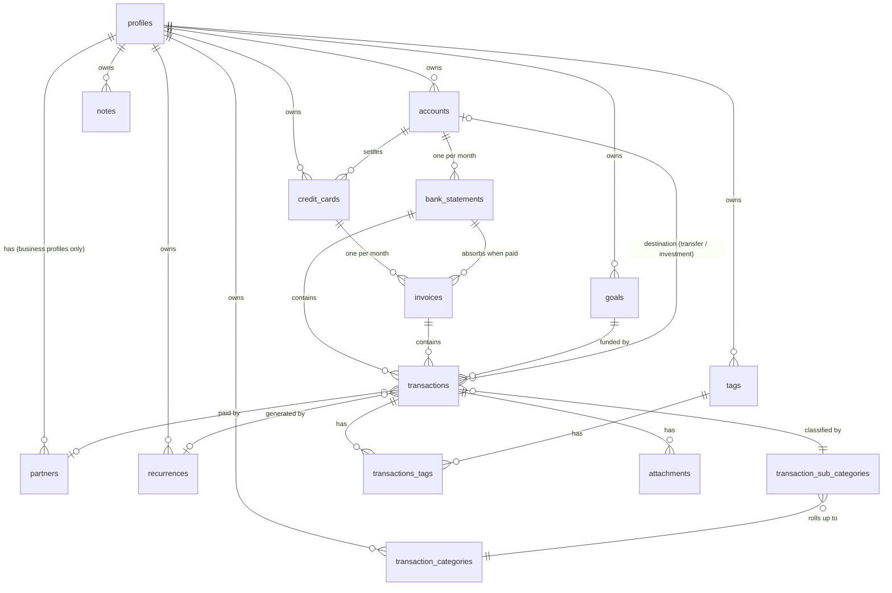

# Database Design

**Status:** Design complete — engine chosen (SQLite), physical contract specified
(types, constraints, foreign-key actions, indexes).
**DDL:** [db/migrations/0001_initial_schema.sql](../../db/migrations/0001_initial_schema.sql)
— a transcription of §4; validated against SQLite 3.46.
**Visual source of truth:** [docs/drawio/project.drawio](../drawio/project.drawio)

This document is the home for every database decision in the project. The draw.io
file holds the picture; this file holds the reasoning and the attribute contracts.
When the two disagree, update both — neither is allowed to drift.

How to read it: [§3](#3-conventions) holds the rules that apply to every table.
[§4](#4-tables) describes each table in full — what it is, the decisions taken about
it, its columns, foreign keys and indexes. The DDL is a transcription of §4 under the
rules of §3; when the two disagree, one of them is wrong and both get fixed.

---

## 1. Scope

The model covers the whole domain described in the [README](../../README.md):
profiles, accounts, credit cards, monthly rollups (bank statements and card
invoices), transactions with their classification, plus the supporting entities
(partners, tags, recurrences, attachments, goals, notes).

It does **not** yet cover two things, both noted in [§6 Next steps](#6-next-steps):
synchronization metadata between devices, and import provenance for the transaction
history being migrated from the current app.

---

## 2. Entity relationship overview



---

## 3. Conventions

Rules that apply to every table. Nothing here is repeated in [§4](#4-tables).

### 3.1 Storage engine — SQLite

**SQLite**, as a single database file on the user's device.

**Why:** the four constraints inherited from the [README](../../README.md) —
embedded, free forever, runs on desktop *and* mobile, does not foreclose future sync —
eliminate almost everything else, and SQLite is strongest on the two that matter most
here:

- **It is already on every mobile platform.** Android and iOS both ship SQLite, and
  every plausible mobile path reaches it. Since the mobile technology is explicitly
  undecided, the engine has to be the part of the stack that survives whatever gets
  picked later.
- **Reports are the point of this project**, and they are relational and
  month-oriented. Window functions, CTEs, partial and expression indexes all come for
  free, so running balances and month-over-month comparisons are ordinary queries
  rather than application code.
- **Data ownership becomes literal** — one file the user can copy, back up, and open
  with any of a hundred tools in thirty years. SQLite's file format carries a public
  commitment to remain readable for decades, which is the right horizon for a
  financial archive.
- **Check constraints, partial indexes and `ON DELETE` actions** let the rules below
  be enforced by the database instead of by convention, and **`REAL` is an IEEE-754
  double**, which is exactly what [§3.7](#37-money) asks for.

**Alternatives considered and rejected:**

| Option | Why not |
|---|---|
| PostgreSQL / MySQL | Require an always-on server. Fails the no-infrastructure and no-cost constraints outright. |
| DuckDB | Superb at the analytical half, but it is OLAP — poor at the many small writes of daily transaction entry, and its mobile story is weak. Worth revisiting *alongside* SQLite for heavy desktop reporting, since DuckDB can query a SQLite file directly. Not the primary store. |
| Document stores (PouchDB/RxDB, CouchDB-style) | Sync comes built in, which is tempting, but they make the relational month-oriented aggregations this project exists to produce substantially harder. Wrong trade. |
| Realm / Atlas Device Sync | Discontinued by MongoDB. A dead end regardless of merits. |
| libSQL / Turso | SQLite-compatible with sync built in, but the sync half pulls toward a hosted service and therefore a recurring cost. Rejected *for now* — and because it is SQLite-compatible, staying on plain SQLite keeps it available later at no migration cost. |

### 3.2 Connection configuration is part of the schema contract

Two pragmas must be set on **every** connection, and neither is visible in the DDL:

- **`PRAGMA foreign_keys = ON`** — SQLite has foreign keys *off by default* for
  backward compatibility. Without it, every `ON DELETE` action in the schema silently
  does nothing, and the rule that deleting a profile removes everything under it
  ([§3.8](#38-profile-is-the-tenant-root-and-foreign-keys-follow-the-relationship))
  quietly fails while appearing to work.
- **`PRAGMA journal_mode = WAL`** — better concurrency and crash resilience. Set once;
  it persists in the file.

Connection setup belongs in one place in the Repository layer that every connection
goes through, not scattered at call sites. It deserves a test that asserts a cascade
actually cascades — the failure mode is silent, and silent failures in delete semantics
lose data.

### 3.3 The Repository layer abstracts the driver, not just the database

The Repository layer is already the only layer that talks to the database
([README](../../README.md)). It is additionally written against a **narrow internal
port** — execute, query, transaction — with a platform-specific adapter behind it,
rather than importing a SQLite driver directly.

**Why:** the engine and the schema are the same everywhere, but *the driver is not*.
Desktop under Electron uses a Node native module; a mobile shell — whichever is chosen —
uses an entirely different SQLite binding with a different API. The SQL is portable
between them; the client library is not. Without the port, that difference leaks into
every repository and the "one backend across desktop and mobile" goal fails at exactly
the layer it was supposed to be solved.

**Consequence:** SQL strings and schema stay shared; only a thin adapter is written per
platform. The Repository layer becomes testable against an in-memory database with no
platform involved. Three other translations live at this same boundary and nowhere
else: identifier casing ([§3.4](#34-naming)), `updated_at` stamping
([§3.6](#36-columns-every-table-carries)) and UUID case normalisation
([§3.5](#35-primary-keys-are-uuids)). If any of them ever appears in two places, that
is a bug.

### 3.4 Naming

**Table names are plural** — `profiles`, `accounts`, `credit_cards`, `transactions`.
A table holds many rows, so the plural reads correctly at the point of use
(`SELECT ... FROM transactions`). The specific convention matters far less than having
exactly one. The plural lands on the **head noun**: a category *of* transactions is
`transaction_categories`, not `categories_transaction`. Join tables follow from both
sides: `transactions_tags`. Domain model classes stay singular — `Transaction`,
`Account` — because one object is one row, and the table↔class mapping is a mechanical
depluralization.

**Physical identifiers are `snake_case`** — tables, columns, indexes, constraints.
TypeScript keeps `camelCase`, and the Repository layer translates between the two.
SQLite genuinely preserves `camelCase`, so this is not forced; it is chosen because
every SQL tool and every human opening the file by hand expects `snake_case`, because
it is immune to the identifier-folding problems of other engines at zero cost, and
because a column name that is byte-identical to a domain property welds the domain
model to the storage schema. An explicit mapping is evidence of the boundary, not
overhead. Two columns were renamed on this basis: `limit` → `limit_value` (a SQLite
keyword) and `goals.date` → `target_date` (legibility).

**Foreign-key columns** are named `<parent_singular>_id`. **Indexes** are
`idx_<table>_<columns>` when plain and `uq_<table>_<columns>` when unique.
**Constraints** are named too — `ck_<table>_<column>` for checks,
`fk_<table>_<column>` for foreign keys — so a violation reports *which* rule failed
(`CHECK constraint failed: ck_profiles_currency`) instead of echoing the expression.

### 3.5 Primary keys are UUIDs

Every table has `id TEXT NOT NULL PRIMARY KEY CHECK (length(id) = 36)` — a UUID
surrogate key, never an autoincrement integer.

**Why:** the README keeps device-to-device sync open as a future direction, and
autoincrement keys make that considerably harder — two devices offline at the same time
will both mint id `47` for different records, and reconciling that means rewriting keys
and every foreign key pointing at them. UUIDs let any device create a record at any
time, offline, with no coordination and no collision.

**Consequence:**

- **Version 4 (random)**, generated with the platform's built-in `crypto.randomUUID()`
  — no library, no clock, no monotonicity to get right. A time-ordered UUID (v7) was
  considered for index locality and rejected: at this project's scale — tens of
  thousands of rows — the difference is unmeasurable, nothing sorts by key (every
  chronological query orders by `due_date`), and the only property being bought is
  collision-free creation on two offline devices, which v4 already gives.
- **The application generates ids, not the database.** The Service layer can build a
  fully-formed object graph, ids included, before anything touches the Repository, and
  the Repository writes it parents-first in one transaction.
- **Stored as `TEXT`**, canonical 36-character lowercase hyphenated form. A 16-byte
  `BLOB` is half the size, but at this scale the difference is negligible and readable
  keys make debugging and hand-inspection of the file far easier. The Repository
  boundary normalises case, since SQLite compares keys byte-for-byte.
- **Ordinary rowid tables**, not `WITHOUT ROWID`. The saved second lookup is
  unmeasurable here, and rowid tables are what every tool assumes.

### 3.6 Columns every table carries

Present on every table — the join table included — and omitted from the per-table
listings in [§4](#4-tables) and from the diagram boxes:

| Column | Type | Constraints | Notes |
|---|---|---|---|
| `id` | TEXT | NN, `PRIMARY KEY`, `CHECK (length(id) = 36)` | uuid — [§3.5](#35-primary-keys-are-uuids) |
| `created_at` | TEXT | NN, timestamp, `DEFAULT (strftime('%Y-%m-%d %H:%M:%S', 'now'))` | UTC. The database fills it; the application never writes it |
| `updated_at` | TEXT | NN, timestamp | UTC. Stamped by the application on every insert and update; no trigger |
| `deleted_at` | TEXT | null, timestamp | Soft-delete flag. A row is live when `deleted_at IS NULL` |

**Who stamps what:** `created_at` is set exactly once and the engine clock is as good
as any; a default also keeps hand-inserts through a database browser honest.
`updated_at` must move on every write, and a trigger would be business logic hidden in
the storage layer — the same objection [§3.10](#310-what-the-database-enforces-and-what-the-application-enforces)
raises against check constraints for rules. It also keeps one clock source for the
column that matters to sync. Both are UTC; presentation converts to local time, storage
never does.

**Nothing is physically removed.** Deleting a row means setting `deleted_at`. This
decision is larger than it looks:

- **`ON DELETE` actions stop doing the work.** A soft delete is an `UPDATE`, so no
  cascade fires. Deleting a profile means stamping `deleted_at` across every descendant
  table, in one transaction, in the Service layer, following the same ownership graph
  the foreign keys declare ([§3.8](#38-profile-is-the-tenant-root-and-foreign-keys-follow-the-relationship)).
  The declared actions stay — they are the backstop for a genuine hard delete — but they
  are no longer the mechanism.
- **Every uniqueness rule is a partial unique index** — `WHERE deleted_at IS NULL`.
  Otherwise deleting March's statement and recreating it collides with the still-present
  old row. This is the defect most likely to be discovered late.
- **Every read must filter `deleted_at IS NULL`.** Forgetting it in a balance query
  silently resurrects deleted transactions into the totals — a wrong number, not an
  error. The balance recalculation routine ([§3.7](#37-money)) must exclude soft-deleted
  rows, and its tests should include a soft-deleted transaction specifically to prove it.
- **`updated_at` is a natural sync input**, and `deleted_at` is what lets a deletion
  propagate between devices at all — a hard delete leaves nothing to replicate.

### 3.7 Money

**Every monetary column is `REAL`** — `transactions.value`, `transactions.charges`,
`transactions.conversion_rate`, `accounts.balance`, `bank_statements.balance`,
`invoices.balance`, `goals.value`, `credit_cards.limit_value`. The common advice to use
integer minor units (cents) is **deliberately rejected**: the system is not restricted
to two-decimal currencies, exchange rates carry far more precision than two places, and
a fixed scale is wrong for some value the app legitimately needs to store. The database
therefore does not protect against rounding drift, and **validation and rounding are
the application's responsibility** — applied at persistence and presentation
boundaries, never on accumulated intermediates; per currency, driven by its decimal
precision; and never compared for exact float equality, always with an epsilon.

**Every monetary column is denominated in the profile's currency.** Three currency
columns exist and have three different jobs:

| Column | Meaning |
|---|---|
| `profiles.currency` | The reporting currency — the only unit anything is stored in. |
| `accounts.currency` | What the real-world account is held in. A label, not a unit. |
| `transactions.currency` | The **origin** currency an amount came from. Provenance only — see [§4.13](#413-transactions). |

**Why single-currency:** it makes every balance and every report a plain `SUM` with no
conversion step anywhere. Storing each account in its own currency would push a
conversion into every profile-level total — real multi-currency machinery, for a
capability the project explicitly does not want. Consolidating accounts is therefore
just addition, including foreign ones, because their transactions were already
converted on the way in. Rounding becomes trivially concrete: one currency, one
precision, the profile's.

**Stored balances are derived values.** `accounts.balance`, `bank_statements.balance`
and `invoices.balance` are denormalized aggregates of the underlying transactions —
recomputing them from the full history on every read is the wrong trade for a
local-first app that opens to a balance screen on mobile. They are a cache, and the
Service layer owns keeping them correct. A recalculation routine that rebuilds them from
transactions must exist from day one, both as a repair tool and as the test oracle; it
doubles as the drift detector — a recalculated balance diverging from the stored one
beyond the currency's epsilon is a bug to surface, not to silently correct.

### 3.8 Profile is the tenant root, and foreign keys follow the relationship

Everything in the system is owned by a profile, directly or transitively, and deleting
a profile deletes every record associated with it. The app is local-first and
single-user, but the same person needs to keep personal and business finances strictly
separate; making the profile the root gives that separation without real
multi-tenancy. Categories, goals and tags are therefore **not** a shared global
vocabulary — a personal and a business profile each maintain their own.

Not every foreign key cascades, though. The `ON DELETE` action is chosen by what the
relationship *means*, and is recorded per key in [§4](#4-tables):

| Kind | Meaning | Action | Examples |
|---|---|---|---|
| **Ownership** | The child cannot exist without the parent | `CASCADE` | `accounts.profile_id`, `bank_statements.account_id`, `transactions.bank_statement_id`, `attachments.transaction_id` |
| **Reference** | The child survives; only the link goes away | `SET NULL` | `transactions.goal_id`, `transactions.partner_id`, `transactions.destination_account_id`, `invoices.bank_statement_id` |
| **Vocabulary** | The parent is a classification the child requires | `NO ACTION` | `transactions.sub_category_id` |

**Why `NO ACTION` and not `RESTRICT` for the vocabulary case:** SQLite checks
`RESTRICT` *the instant* the parent row is removed, whereas `NO ACTION` is checked at
the **end of the statement**. During a profile hard delete the cascade may reach
`transaction_sub_categories` before it reaches `transactions`; with `RESTRICT` the
whole delete fails, with `NO ACTION` the check runs after the transactions are gone and
passes. Both still reject deleting a sub-category that is genuinely in use.

**Consequence:** the per-key choices are a first pass, to be re-examined when the first
migration is written — with a test that hard-deletes a fully populated profile and
asserts nothing of it remains. A transaction with neither container set (the invalid
state [§3.10](#310-what-the-database-enforces-and-what-the-application-enforces)
accepts) is never reached by the cascade and makes that delete **fail** with a
foreign-key error — the right outcome; the integrity-check routine exists to find such
rows first.

### 3.9 Types and column domains

SQLite uses type *affinity* rather than strict typing, and has no native boolean, date
or UUID type. Left alone it silently accepts a string in a numeric column, which is
incompatible with the strict-typing standard in [CLAUDE.md](../../CLAUDE.md). So:

- **All tables are declared `STRICT`.** SQLite rejects values that cannot be converted
  losslessly to the column type instead of silently storing them. Non-negotiable. One
  nuance: a numeric-looking string such as `'1'` is still accepted into an `INTEGER`
  column — `STRICT` guards the stored type, not the caller's discipline; the typed
  Repository boundary does the rest.
- **Money → `REAL`.** **Booleans → `INTEGER`** `0`/`1`. **Enums → `INTEGER`**, using
  the numeric values assigned in the diagram. **UUIDs → `TEXT`.**
- **Dates → `TEXT`, ISO-8601** (`YYYY-MM-DD`; timestamps `YYYY-MM-DD HH:MM:SS`), UTC.
  Text ISO-8601 sorts and compares correctly as a string, works with SQLite's date
  functions, and stays readable when someone opens the file by hand — which matters
  more here than the bytes saved by epoch integers.

`STRICT` only knows `INTEGER`, `REAL` and `TEXT`, so a column's **domain** is finished
with a `CHECK` constraint. The catalogue, used verbatim in [§4](#4-tables):

| Domain | Constraint |
|---|---|
| bool | `CHECK (col IN (0, 1))` |
| enum | `CHECK (col IN (1, 2, …))`, the literal set from the diagram |
| date | `CHECK (col IS strftime('%Y-%m-%d', col))` — an invalid or non-canonical date (`2024-02-30`) makes `strftime` return something else, so the comparison fails |
| timestamp | `CHECK (col IS strftime('%Y-%m-%d %H:%M:%S', col))` |
| uuid | `CHECK (length(col) = 36)` |
| currency | `CHECK (length(col) = 3 AND col = upper(col))` — ISO 4217 |
| `varchar(n)` | `CHECK (length(col) <= n)` |
| ranges | `month` 1–12, day-of-month 1–31, `year` 1900–9999, `installments > 0`, `percentage` 0–100 |
| filename | 1–255 bytes, no `/` or `\` — used only by `attachments.name`, which is a path component |

**Defaults exist only where the absence of a value has a domain meaning** — `paid = 0`,
`charges = 0`, `conversion_rate = 1`, `consider_balance = 1` — never to cover a
repository that forgot to write a column.

SQLite cannot alter a `CHECK` without rebuilding the table, so only invariants that will
not move belong here. Growing an enum is the one foreseeable change, and it costs a
table rebuild — accepted, since it is rare and migrations exist for it. The chosen
lengths and ranges are open to review before the first migration; after it they are
contract.

**Notation in §4:** *NN* = `NOT NULL`; nullable columns say *null*. *date* and
*timestamp* in a constraint cell stand for the format checks above.

### 3.10 What the database enforces, and what the application enforces

| Enforced by the database | Enforced by the application |
|---|---|
| Types — `STRICT` tables ([§3.9](#39-types-and-column-domains)) | Business rules and conditional field validity |
| Column domains — `CHECK` on enums, booleans, date format, lengths, ranges ([§3.9](#39-types-and-column-domains)) | Conditional validity of one column given another (`paid` / `payment_date`, `installments` given `type`) |
| Referential integrity — foreign keys ([§3.8](#38-profile-is-the-tenant-root-and-foreign-keys-follow-the-relationship)) | Rounding and monetary precision ([§3.7](#37-money)) |
| Uniqueness — partial indexes ([§3.11](#311-indexes)) | Cross-column consistency, including both exclusive arcs |

Structure is the database's job; meaning is the application's. A domain says what a
single column can hold, in isolation, and never changes with a business rule. Anything
relating two columns or two rows stays out: the exclusive arcs on `transactions` and
`recurrences`, `paid` versus `payment_date`, partners only on business profiles, a
card's account belonging to the same profile, partner shares summing to 100, the sign
of `value`. A check constraint encoding "a transaction belongs to a statement *or* an
invoice" is a business rule living in the storage layer, where it is invisible to the
code that has to satisfy it and awkward to change.

**The trade-off being accepted:** the database will accept invalid rows. Validation
therefore lives at a **single choke point** in the Service layer, not at each call
site; tests cover the invalid states explicitly; and one integrity-check routine scans
for balance drift ([§3.7](#37-money)), orphaned transactions
([§4.13](#413-transactions)) and missing attachment files
([§4.15](#415-attachments)). Three checks, one routine.

### 3.11 Indexes

- **Every foreign-key column has its own plain index.** SQLite does not create one.
  Without it, every cascade check on a parent delete and every "transactions in this
  statement" lookup is a full scan of the child table — and `transactions` has seven
  foreign keys. These indexes are **not** partial: a soft-deleted row is still a child
  the foreign-key check must find.
- **Every uniqueness rule is a partial unique index**, `WHERE deleted_at IS NULL`
  ([§3.6](#36-columns-every-table-carries)).
- **Names are unique within their scope**, case-insensitively: `tags` and
  `transaction_categories` per profile, `transaction_sub_categories` per category,
  `attachments` per transaction. Two categories both called "Food" are a data-quality
  bug that then shows up as a split in every report. `COLLATE NOCASE` folds ASCII only —
  `Alimentação` and `alimentação` stay distinct; accepted, the application normalizes on
  input if it matters. `accounts`, `credit_cards`, `partners` and `goals` are
  deliberately **not** name-unique — two accounts at the same bank called "Checking" are
  legitimate.

---

## 4. Tables

One section per table, in dependency order. Each lists what the table is, the decisions
taken about it, then its columns, foreign keys and indexes. The columns of
[§3.6](#36-columns-every-table-carries) are omitted everywhere.

### 4.1 profiles

The tenant root — think of it as the user table. Every other record in the system
hangs off a profile, directly or transitively ([§3.8](#38-profile-is-the-tenant-root-and-foreign-keys-follow-the-relationship)).

#### A profile is either personal or business, and that gates partners

`type` separates the two. Partners ([§4.2](#42-partners)) are only meaningful for
business profiles, and partner-based reports are unavailable for personal ones. The
constraint "a personal profile has no partners" relates two tables, so it is enforced
in the Service layer, not by the database
([§3.10](#310-what-the-database-enforces-and-what-the-application-enforces)).

#### The profile's currency is the unit everything is stored in

`currency` is the reporting currency. Every monetary column in the database is
denominated in it ([§3.7](#37-money)); the currency columns on `accounts` and
`transactions` are labels, not units.

#### Columns

| Column | Type | Constraints | Notes |
|---|---|---|---|
| `name` | TEXT | NN, `CHECK (length(name) <= 45)` | |
| `type` | INTEGER | NN, `CHECK (type IN (1, 2))` | enum — `1: personal`, `2: business` |
| `currency` | TEXT | NN, currency | ISO 4217 (`BRL`, `USD`) |

No foreign keys. No indexes beyond the primary key.

### 4.2 partners

Individuals holding a share of a **business** profile. Each partner has a percentage
share, used to display the distribution of expenses and revenue.

#### Share versus payment are different numbers

`percentage` is what a partner *owns*. Which partner actually *paid* a given
transaction is recorded on the transaction itself (`transactions.partner_id`,
[§4.13](#413-transactions)). What a partner paid and what they owe by their share are
different numbers, and the gap between them is the interesting report.

That the shares of one profile sum to 100, and that the profile is a business one, are
application rules ([§3.10](#310-what-the-database-enforces-and-what-the-application-enforces)).
Partner names are not unique — nothing prevents two people with the same name.

#### Columns

| Column | Type | Constraints | Notes |
|---|---|---|---|
| `profile_id` | TEXT | NN, FK | |
| `name` | TEXT | NN, `CHECK (length(name) <= 100)` | |
| `percentage` | REAL | NN, `CHECK (percentage >= 0 AND percentage <= 100)` | Ownership share, 0–100 scale |

#### Foreign keys

| FK | Target | Null? | On delete | Why |
|---|---|---|---|---|
| `profile_id` | profiles | NN | `CASCADE` | Ownership |

#### Indexes

| Index | Columns | Kind |
|---|---|---|
| `idx_partners_profile_id` | `(profile_id)` | plain |

### 4.3 notes

A flat list of observations and reminders attached to a profile. Not linked to any
transaction or account — deliberately a simple list.

#### Columns

| Column | Type | Constraints | Notes |
|---|---|---|---|
| `profile_id` | TEXT | NN, FK | |
| `note` | TEXT | NN | Unbounded |

#### Foreign keys

| FK | Target | Null? | On delete | Why |
|---|---|---|---|---|
| `profile_id` | profiles | NN | `CASCADE` | Ownership |

#### Indexes

| Index | Columns | Kind |
|---|---|---|
| `idx_notes_profile_id` | `(profile_id)` | plain |

### 4.4 accounts

A checking or investment account owned by a profile.

#### `balance` is a cache, in the profile's currency

`balance` is a derived value, rebuilt from transactions by the Service layer
([§3.7](#37-money)). It is held in the **profile's** currency, not the account's.

#### `currency` is a label, and `consider_balance` is the isolation mechanism

A foreign bank account can legitimately be held in a different currency; `currency`
records that fact, and nothing more — it does not change how `balance` is stored. The
consequence is that a foreign account's stored balance will **not** match what its bank
reports, because it was converted at the rates applied when each transaction was
entered, and it drifts from reality as rates move. Rather than model that, the user
turns `consider_balance` off and the account drops out of the consolidated total while
keeping its own history intact. This is a deliberate escape hatch, not a workaround.
Reconciling against a foreign bank is out of scope.

#### Columns

| Column | Type | Constraints | Notes |
|---|---|---|---|
| `profile_id` | TEXT | NN, FK | |
| `name` | TEXT | NN, `CHECK (length(name) <= 45)` | Not unique — two "Checking" accounts at different banks are legitimate |
| `balance` | REAL | NN | money — current balance, derived cache |
| `currency` | TEXT | NN, currency | ISO 4217. Descriptive only |
| `consider_balance` | INTEGER | NN, `DEFAULT 1`, `CHECK (consider_balance IN (0, 1))` | bool — counts toward the consolidated balance |
| `type` | INTEGER | NN, `CHECK (type IN (1, 2))` | enum — `1: checking account`, `2: investment account` |

#### Foreign keys

| FK | Target | Null? | On delete | Why |
|---|---|---|---|---|
| `profile_id` | profiles | NN | `CASCADE` | Ownership |

#### Indexes

| Index | Columns | Kind |
|---|---|---|
| `idx_accounts_profile_id` | `(profile_id)` | plain |

### 4.5 credit_cards

Belongs to a profile and is settled by an account.

#### Settled by an account of the same profile

`account_id` is the account that pays the card's invoices ([§4.7](#47-invoices)). The
card is deleted with that account — it cannot exist without the account that settles
it — and the delete action is `CASCADE` rather than `RESTRICT` so that it does not
block a profile cascade ([§3.8](#38-profile-is-the-tenant-root-and-foreign-keys-follow-the-relationship)).
That the account belongs to the **same** profile is an application rule.

#### Closing and due are day numbers

`closing_date` and `due_date` are days of the month (1–31), not dates. The invoice for
a given month closes on `closing_date` and is due on `due_date` — usually of the
following month, which is why an invoice and the statement that absorbs it fall in
different months ([§4.7](#47-invoices)).

#### Columns

| Column | Type | Constraints | Notes |
|---|---|---|---|
| `profile_id` | TEXT | NN, FK | |
| `account_id` | TEXT | NN, FK | The settling account |
| `name` | TEXT | NN, `CHECK (length(name) <= 45)` | |
| `limit_value` | REAL | NN | money — renamed from `limit`, a SQLite keyword |
| `closing_date` | INTEGER | NN, `CHECK (closing_date BETWEEN 1 AND 31)` | Day of month the invoice closes |
| `due_date` | INTEGER | NN, `CHECK (due_date BETWEEN 1 AND 31)` | Day of month the invoice is due |

#### Foreign keys

| FK | Target | Null? | On delete | Why |
|---|---|---|---|---|
| `profile_id` | profiles | NN | `CASCADE` | Ownership |
| `account_id` | accounts | NN | `CASCADE` | Ownership — see above |

#### Indexes

| Index | Columns | Kind |
|---|---|---|
| `idx_credit_cards_profile_id` | `(profile_id)` | plain |
| `idx_credit_cards_account_id` | `(account_id)` | plain |

### 4.6 bank_statements

One record per account per month — the account's monthly container.

#### Monthly rollups are materialized, one row per month

The reports the project exists to produce are month-oriented. Materializing the monthly
rollup keeps report queries cheap and gives a stable historical record even when past
transactions are edited. So `(account_id, year, month)` is a unique key, and rollup rows
are created and recalculated by the Service layer whenever transactions in that month
change. `balance` is the month's closing balance — a derived cache ([§3.7](#37-money)).
`invoices` ([§4.7](#47-invoices)) follows the same rule for credit cards.

#### Columns

| Column | Type | Constraints | Notes |
|---|---|---|---|
| `account_id` | TEXT | NN, FK | |
| `month` | INTEGER | NN, `CHECK (month BETWEEN 1 AND 12)` | |
| `year` | INTEGER | NN, `CHECK (year BETWEEN 1900 AND 9999)` | |
| `balance` | REAL | NN | money — closing balance for the month, derived cache |

#### Foreign keys

| FK | Target | Null? | On delete | Why |
|---|---|---|---|---|
| `account_id` | accounts | NN | `CASCADE` | Ownership |

#### Indexes

| Index | Columns | Kind |
|---|---|---|
| `idx_bank_statements_account_id` | `(account_id)` | plain |
| `uq_bank_statements_account_period` | `(account_id, year, month)` | unique, partial |

### 4.7 invoices

One record per credit card per month — the card's monthly container, under the same
one-row-per-month rule as [§4.6](#46-bank_statements).

#### An invoice settles against a bank statement

When an invoice is paid it is linked to the `bank_statements` row of the month in which
it is paid, so card activity flows into the owning account's monthly balance rather
than sitting in a parallel universe. The invoice's own month and the month of the
statement that absorbs it are usually different — a card closing in March is typically
paid in April — and the model must not assume they are equal. `bank_statement_id` is
null until the invoice is paid, and `SET NULL` on delete: the invoice outlives the
statement that absorbed it and simply becomes unpaid again.

#### Columns

| Column | Type | Constraints | Notes |
|---|---|---|---|
| `credit_card_id` | TEXT | NN, FK | |
| `bank_statement_id` | TEXT | null, FK | The statement of the month in which the invoice is paid |
| `month` | INTEGER | NN, `CHECK (month BETWEEN 1 AND 12)` | |
| `year` | INTEGER | NN, `CHECK (year BETWEEN 1900 AND 9999)` | |
| `balance` | REAL | NN | money — invoice total for the month, derived cache |

#### Foreign keys

| FK | Target | Null? | On delete | Why |
|---|---|---|---|---|
| `credit_card_id` | credit_cards | NN | `CASCADE` | Ownership |
| `bank_statement_id` | bank_statements | null | `SET NULL` | Reference |

#### Indexes

| Index | Columns | Kind |
|---|---|---|
| `idx_invoices_credit_card_id` | `(credit_card_id)` | plain |
| `idx_invoices_bank_statement_id` | `(bank_statement_id)` | plain |
| `uq_invoices_credit_card_period` | `(credit_card_id, year, month)` | unique, partial |

### 4.8 transaction_categories

The upper level of the two-level classification hierarchy. Owned by a profile, so a
personal and a business profile each maintain their own vocabulary and neither can see
the other's ([§3.8](#38-profile-is-the-tenant-root-and-foreign-keys-follow-the-relationship)).
Names are unique per profile, case-insensitively ([§3.11](#311-indexes)).

> Renamed from `CategoriesTransation` — spelling corrected, and the plural moved to the
> head noun ([§3.4](#34-naming)).

#### Columns

| Column | Type | Constraints | Notes |
|---|---|---|---|
| `profile_id` | TEXT | NN, FK | |
| `name` | TEXT | NN, `CHECK (length(name) <= 45)` | |

#### Foreign keys

| FK | Target | Null? | On delete | Why |
|---|---|---|---|---|
| `profile_id` | profiles | NN | `CASCADE` | Ownership |

#### Indexes

| Index | Columns | Kind |
|---|---|---|
| `idx_transaction_categories_profile_id` | `(profile_id)` | plain |
| `uq_transaction_categories_profile_name` | `(profile_id, name COLLATE NOCASE)` | unique, partial |

### 4.9 transaction_sub_categories

The lower level of the hierarchy. A transaction points at a sub-category; the
sub-category rolls up to a category. Scoped to a profile transitively through its
category. Names are unique per category, case-insensitively.

> Renamed from `SubCategoriesTransaction`, for the same reason as its parent.

#### Columns

| Column | Type | Constraints | Notes |
|---|---|---|---|
| `category_id` | TEXT | NN, FK | |
| `name` | TEXT | NN, `CHECK (length(name) <= 45)` | |

#### Foreign keys

| FK | Target | Null? | On delete | Why |
|---|---|---|---|---|
| `category_id` | transaction_categories | NN | `CASCADE` | Ownership |

#### Indexes

| Index | Columns | Kind |
|---|---|---|
| `idx_transaction_sub_categories_category_id` | `(category_id)` | plain |
| `uq_transaction_sub_categories_category_name` | `(category_id, name COLLATE NOCASE)` | unique, partial |

### 4.10 tags

Free-form labels owned by a profile, many-to-many with transactions through
[§4.14](#414-transactions_tags). Names are unique per profile, case-insensitively.

#### Columns

| Column | Type | Constraints | Notes |
|---|---|---|---|
| `profile_id` | TEXT | NN, FK | |
| `name` | TEXT | NN, `CHECK (length(name) <= 45)` | |

#### Foreign keys

| FK | Target | Null? | On delete | Why |
|---|---|---|---|---|
| `profile_id` | profiles | NN | `CASCADE` | Ownership |

#### Indexes

| Index | Columns | Kind |
|---|---|---|
| `idx_tags_profile_id` | `(profile_id)` | plain |
| `uq_tags_profile_name` | `(profile_id, name COLLATE NOCASE)` | unique, partial |

### 4.11 goals

A savings or spending target owned by a profile, funded by the transactions linked to
it (`transactions.goal_id`).

#### Progress is computed, never stored

`goals` carries a target (`value`, `target_date`) but no progress column. How much has
been put toward a goal is always derived by summing the transactions linked to it.

This is a deliberate departure from the cached balances of [§3.7](#37-money), and the
difference is the read pattern. Account balances are read constantly — the app opens to
them — which is what justifies caching. Goal progress is read only when someone opens a
goals screen, and the transaction set behind a single goal is small. Caching it would
add a second denormalized value to keep correct in exchange for nothing. The
goal ↔ transaction link is the sole source of truth; no recalculation routine is
needed and no drift is possible.

#### Columns

| Column | Type | Constraints | Notes |
|---|---|---|---|
| `profile_id` | TEXT | NN, FK | |
| `name` | TEXT | NN, `CHECK (length(name) <= 45)` | |
| `value` | REAL | NN | money — target amount |
| `target_date` | TEXT | null, date | Renamed from `date` ([§3.4](#34-naming)). Nullable: an open-ended goal (an emergency fund) has no deadline |

#### Foreign keys

| FK | Target | Null? | On delete | Why |
|---|---|---|---|---|
| `profile_id` | profiles | NN | `CASCADE` | Ownership |

#### Indexes

| Index | Columns | Kind |
|---|---|---|
| `idx_goals_profile_id` | `(profile_id)` | plain |

### 4.12 recurrences

The rule that produces repeating transactions. It covers two distinct shapes,
separated by `type`:

- **`1: installments`** — one purchase split into a fixed number of parts (a purchase
  paid in 12x). The count is known up front and the series is finite.
- **`2: fixed`** — a recurring charge with no inherent end (rent, a subscription). It
  runs until `end_at`, or indefinitely when `end_at` is null.

`recurrence` is the interval between occurrences and applies to both.

#### Owned directly by the profile

`profile_id` is `NOT NULL` and cascades from `profiles`. The foreign key between rules
and occurrences points from the transaction to the rule (`transactions.recurrence_id`),
so without its own `profile_id` a rule would have **no path back to its profile**: a
rule whose occurrences were all soft-deleted became unreachable, a profile hard delete
would orphan every rule, and not-yet-materialized occurrences need a profile to be
emitted into independent of any existing row.

#### A rule materializes one real transaction per occurrence

A recurrence emits **real `transactions` rows**, one per occurrence. It is not a
template expanded at read time. Every transaction must sit in exactly one monthly
container ([§4.13](#413-transactions)) and those containers carry a settled balance
([§4.6](#46-bank_statements)): installment 3 of 12 has to land in a specific invoice,
be individually markable as paid, and be individually editable when its value changes.
A virtual occurrence computed at read time can do none of that. Creating a recurrence
is therefore a write of N rows, each with its own container, `due_date` and `paid`
flag — done in one transaction.

#### `installments` and `end_at` are exclusive by type; `value_type` only applies to installments

The two shapes terminate differently. An installment series ends by *count*
(`installments`, finite and known at creation); a fixed series ends by *date*
(`end_at`), or never. Each column is null for the other type.

`value_type` states how to read the `value` on the transactions the rule emits —
`1: total` ("1200 in 12x") or `2: per_installment` ("12x of 100"). Both readings are
natural depending on how the purchase was presented, and guessing wrong misstates every
monthly total by a factor of the installment count, so the user chooses explicitly. A
`fixed` recurrence is always per-occurrence by definition, so `value_type` is null for
it.

Which of the three must be set for a given `type` is an application rule
([§3.10](#310-what-the-database-enforces-and-what-the-application-enforces)); the
checks below only bound each value when present.

#### Finite series materialize in full; endless ones roll forward

- **Finite** — `installments`, or `fixed` with an `end_at`: the **entire series is
  written at creation**, in one database transaction. The count is known, the row count
  is bounded and trivial, and it is what the user expects — someone who buys in 24x
  wants to see 24 entries and the invoice each lands in. Partial generation would make
  a future invoice look empty until some background pass caught up.
- **Endless** — `fixed` with `end_at` null: occurrences are written out to a **rolling
  horizon of 12 months**, extended as time passes. Twelve covers a full year of
  forecasting and is the minimum that shows at least one occurrence of a `yearly` rule.
  The cost is negligible — a monthly rule is 12 rows a year.

**`materialized_through` is the watermark** recording how far the rule has been
expanded. Top-up generates occurrences from the watermark forward to
`today + 12 months`, then advances it. It runs on app launch and after any recurrence
edit, and it is the same mechanism for both cases — a finite series simply reaches its
end and stops. A watermark rather than "does a row exist for this date?" because:

- It is **inherently idempotent** — running top-up twice writes nothing the second
  time, with no scan of `transactions` at all.
- **It makes deletion stick.** If top-up checked for a live row, a user who deletes
  April's rent would find it **recreated on next launch**, because the soft delete
  hides the row from that query. A forward-only watermark never revisits a date it has
  passed.
- It is inspectable — "how far has this rule been expanded" is a column, not an
  inferred property.

Consequences: top-up writes on launch, so it must be transactional and must not run
before the database is ready, and it is a write that sync has to reconcile. A `fixed`
rule with a very distant `end_at` (the year 2099) is finite on paper but falls back to
the rolling behaviour rather than emitting nine hundred rows — the rule is "bounded
work at creation". The double-generation backstop is the unique index
`uq_transactions_recurrence_due_date` on [§4.13](#413-transactions): two devices running
top-up while offline would otherwise both emit the same occurrence, and the constraint
turns that into a detectable conflict rather than a silent duplicate.

#### Editing a recurring transaction asks the user for scope

When a user edits or deletes a transaction that came from a recurrence, the app asks
which occurrences it applies to: **only this one**, **this and future ones**, or **all
of them**. There is no default that is right more than about half the time — a
subscription price rising applies going forward, a misspelled name applies to the whole
series, an unusual amount in one month applies to exactly one row — and guessing
silently rewrites data the user did not intend to touch, which in a finance app means
wrong historical numbers.

- This is a Service-layer concern, and the payoff of materializing real rows: all three
  scopes are just different `WHERE` clauses over the rows sharing a `recurrence_id`.
- **"Future" is defined by `due_date`**, never by insertion order or id.
- Scopes 2 and 3 also update the `recurrences` row itself, since the rule that emits
  any not-yet-materialized occurrences must agree with what the user asked for. They do
  not need to move the watermark — the horizon is unchanged. Scope 1 leaves the rule
  alone.
- Deleting follows the same three scopes, stamping `deleted_at` across the selected
  set in one transaction.
- Any scope touching a past occurrence changes a month with a settled balance, so
  recalculation reruns for every affected month.
- **Already-paid occurrences are not protected.** The app must **confirm before
  executing** when the selected set contains paid rows, saying what is actually at
  stake — how many paid occurrences, which months' balances will move — rather than a
  generic warning. Past figures in this system are mutable by design: a personal
  finance tool is often *correcting* history rather than recording it. The cost is
  that a report run twice can legitimately differ, and `updated_at` is the only trace
  that a past number was revised.

#### Columns

| Column | Type | Constraints | Notes |
|---|---|---|---|
| `profile_id` | TEXT | NN, FK | |
| `type` | INTEGER | NN, `CHECK (type IN (1, 2))` | enum — `1: installments`, `2: fixed` |
| `recurrence` | INTEGER | NN, `CHECK (recurrence IN (1, 2, 3, 4))` | enum — `1: daily`, `2: weekly`, `3: monthly`, `4: yearly` |
| `installments` | INTEGER | null, `CHECK (installments IS NULL OR installments > 0)` | Number of parts — `type = 1` only |
| `value_type` | INTEGER | null, `CHECK (value_type IS NULL OR value_type IN (1, 2))` | enum — `1: total`, `2: per_installment` — `type = 1` only |
| `end_at` | TEXT | null, date | When the rule stops emitting — `type = 2` only |
| `materialized_through` | TEXT | NN, date | Watermark; only moves forward. Always set, since creation materializes at least the first horizon |

#### Foreign keys

| FK | Target | Null? | On delete | Why |
|---|---|---|---|---|
| `profile_id` | profiles | NN | `CASCADE` | Ownership |

#### Indexes

| Index | Columns | Kind |
|---|---|---|
| `idx_recurrences_profile_id` | `(profile_id)` | plain |

### 4.13 transactions

The central entity. Every movement of money — income, expense, transfer or
investment — is a transaction, and every transaction is classified by a sub-category.

#### A transaction belongs to exactly one monthly container

An account transaction lands in a bank statement; a card transaction lands in an
invoice. `bank_statement_id` and `invoice_id` are alternatives, not simultaneous
parents — an exclusive arc implemented as two nullable foreign keys. "Exactly one is
set" is enforced in the application, not by a `CHECK`
([§3.10](#310-what-the-database-enforces-and-what-the-application-enforces)). The
trade-off: a row with both null violates no constraint, belongs to no container, and
would disappear from every report while still existing — a silent absence. The
integrity-check routine scans for such orphans, and a profile hard delete fails on
them ([§3.8](#38-profile-is-the-tenant-root-and-foreign-keys-follow-the-relationship)).

#### `value` is stored converted; `currency` and `conversion_rate` are provenance

`value` is **always already converted** into the profile's currency
([§3.7](#37-money)). It is never the foreign amount. `currency` records the origin
currency and `conversion_rate` the rate the user asserts was applied; neither is ever
used in arithmetic. Foreign currency is explicitly not a focus of this app, and storing
the converted value means every report, balance and rollup is a plain sum — no join to
a rate, no multiplication, no null-rate edge case.

- **No report ever multiplies by `conversion_rate`.** If any query does, that is a bug.
- `conversion_rate` is what the user asserts was used, not a live market rate, and is
  never re-derived. It defaults to `1` — no conversion happened.
- **The original foreign amount is not stored.** A user who wants it records it in
  `description` as free text. It is not queryable, and that is accepted.
- This is the strongest justification for keeping money as `REAL`: `value` is
  single-currency, but `conversion_rate` still needs far more than two decimals.

#### Transfers and investments carry a destination account

A transaction of type `3: transference` or `4: investment` links to a second account —
the destination of the funds — through `destination_account_id`, null for every other
type. Reports must avoid double-counting: a transfer is not net income or net expense
at the profile level, only at the account level.

#### A transaction records which partner paid it

`partner_id` identifies the partner who paid this specific transaction — distinct from
the ownership share on [§4.2](#42-partners). It takes part in no exclusive arc: null for
every transaction on a personal profile, and nullable on a business profile too, since
no partner may be recorded as the payer. Reports that split by partner must handle
unattributed transactions rather than assuming the link is present.

#### The other links

`goal_id` — a transaction may contribute to one goal or none ([§4.11](#411-goals)).
`recurrence_id` — set only on transactions emitted by a rule ([§4.12](#412-recurrences)).
Neither constrains the other or anything else. `paid` and `payment_date` must agree,
which is an application rule.

#### Columns

| Column | Type | Constraints | Notes |
|---|---|---|---|
| `sub_category_id` | TEXT | NN, FK | Every transaction is classified |
| `bank_statement_id` | TEXT | null, FK | Exclusive with `invoice_id` |
| `invoice_id` | TEXT | null, FK | Exclusive with `bank_statement_id` |
| `destination_account_id` | TEXT | null, FK | `type` 3 and 4 only |
| `partner_id` | TEXT | null, FK | Business profiles only, optional even there |
| `goal_id` | TEXT | null, FK | |
| `recurrence_id` | TEXT | null, FK | Emitted-by-rule only |
| `name` | TEXT | NN, `CHECK (length(name) <= 100)` | Length was unspecified in the diagram; 100 chosen |
| `description` | TEXT | null | Unbounded free text |
| `value` | REAL | NN | money — **always already converted** into the profile's currency |
| `currency` | TEXT | NN, currency | ISO 4217 — the **origin** currency. Provenance only |
| `conversion_rate` | REAL | NN, `DEFAULT 1` | The rate applied. Provenance only |
| `due_date` | TEXT | NN, date | |
| `paid` | INTEGER | NN, `DEFAULT 0`, `CHECK (paid IN (0, 1))` | bool |
| `payment_date` | TEXT | null, date | |
| `charges` | REAL | NN, `DEFAULT 0` | money — fees / interest applied on top of `value` |
| `type` | INTEGER | NN, `CHECK (type IN (1, 2, 3, 4))` | enum — `1: income`, `2: expense`, `3: transference`, `4: investment` |

#### Foreign keys

This table carries more foreign keys than any other, and most are nullable for
*different and unrelated reasons*. Only the container pair is an exclusive arc.

| FK | Target | Null? | On delete | Why |
|---|---|---|---|---|
| `sub_category_id` | transaction_sub_categories | NN | `NO ACTION` | Vocabulary — deliberately not `RESTRICT` ([§3.8](#38-profile-is-the-tenant-root-and-foreign-keys-follow-the-relationship)) |
| `bank_statement_id` | bank_statements | null | `CASCADE` | Ownership — the container |
| `invoice_id` | invoices | null | `CASCADE` | Ownership — the container |
| `destination_account_id` | accounts | null | `SET NULL` | Reference — the transaction survives its destination |
| `partner_id` | partners | null | `SET NULL` | Reference |
| `goal_id` | goals | null | `SET NULL` | Reference — deleting a goal must not delete what funded it |
| `recurrence_id` | recurrences | null | `SET NULL` | Reference — occurrences survive their rule |

#### Indexes

| Index | Columns | Kind |
|---|---|---|
| `idx_transactions_sub_category_id` | `(sub_category_id)` | plain |
| `idx_transactions_bank_statement_id` | `(bank_statement_id)` | plain |
| `idx_transactions_invoice_id` | `(invoice_id)` | plain |
| `idx_transactions_destination_account_id` | `(destination_account_id)` | plain |
| `idx_transactions_partner_id` | `(partner_id)` | plain |
| `idx_transactions_goal_id` | `(goal_id)` | plain |
| `idx_transactions_recurrence_id` | `(recurrence_id)` | plain |
| `idx_transactions_due_date` | `(due_date)` | plain — date-range reports and the "this and future" scope |
| `uq_transactions_recurrence_due_date` | `(recurrence_id, due_date)` | unique, partial — `WHERE deleted_at IS NULL AND recurrence_id IS NOT NULL` |

### 4.14 transactions_tags

Join table resolving the many-to-many between transactions and tags. It carries the
common columns of [§3.6](#36-columns-every-table-carries) like every other table, soft
delete included, so the pair is unique among live rows only.

#### Columns

| Column | Type | Constraints | Notes |
|---|---|---|---|
| `transaction_id` | TEXT | NN, FK | |
| `tag_id` | TEXT | NN, FK | |

#### Foreign keys

| FK | Target | Null? | On delete | Why |
|---|---|---|---|---|
| `transaction_id` | transactions | NN | `CASCADE` | Ownership |
| `tag_id` | tags | NN | `CASCADE` | Ownership — a link cannot outlive either side |

#### Indexes

| Index | Columns | Kind |
|---|---|---|
| `idx_transactions_tags_transaction_id` | `(transaction_id)` | plain |
| `idx_transactions_tags_tag_id` | `(tag_id)` | plain |
| `uq_transactions_tags_pair` | `(transaction_id, tag_id)` | unique, partial |

### 4.15 attachments

A file attached to a transaction — typically a receipt or an invoice PDF.

#### The bytes live on disk at a derived path

The row stores **only** `name`, extension included. The file sits on disk at a path
built by convention:

```
profile/{profileID}/attachments/{transactionID}/{attachmentName}
```

Receipt photos and PDFs run to megabytes. Holding them as blobs would inflate the
single database file that every backup and every future sync has to move, for data
that is written once and read rarely. Foldering by transaction also makes the tree
navigable — everything belonging to one transaction sits together, which is what
someone digging through a backup by hand wants.

Consequences:

- **The database is no longer the whole system of record.** Any backup or export must
  cover the attachments tree too, or it is silently incomplete.
- **Rows and files can drift.** A missing file is not a foreign-key violation; the
  integrity-check routine walks attachments and reports missing files.
- **Soft delete widens the gap.** A deleted attachment's row persists and so does its
  file. Whatever eventually purges soft-deleted rows must delete the files in the same
  pass.
- **`name` is a path component.** Hence the 255-byte cap and the ban on separators in
  its domain check, and the unique index per transaction: two live files cannot share
  a path. Case-insensitive, because macOS and Windows filesystems are. What the
  database cannot see is a *soft-deleted* attachment whose file is still on disk under
  that name, so the app must still check the filesystem — or rename — on upload.

#### Columns

| Column | Type | Constraints | Notes |
|---|---|---|---|
| `transaction_id` | TEXT | NN, FK | |
| `name` | TEXT | NN, `CHECK (length(name) BETWEEN 1 AND 255 AND instr(name, '/') = 0 AND instr(name, '\') = 0)` | The original file name, extension included |

#### Foreign keys

| FK | Target | Null? | On delete | Why |
|---|---|---|---|---|
| `transaction_id` | transactions | NN | `CASCADE` | Ownership |

#### Indexes

| Index | Columns | Kind |
|---|---|---|
| `idx_attachments_transaction_id` | `(transaction_id)` | plain |
| `uq_attachments_transaction_name` | `(transaction_id, name COLLATE NOCASE)` | unique, partial |

---

## 5. Notes carried over from the diagram

Verbatim annotations from `project.drawio`, preserved so nothing is lost if the
diagram is refactored:

- *"Profiles: think of this as a user table. All records are linked to this profile table. If a profile is deleted, everything associated with it is deleted. The profile can be personal or business."*
- *"'Partners' defines a list of individuals associated with the profile if it is a business type. Each partner has a specific percentage share; this is used to display the distribution of expenses and revenue based on that partner's percentage."*
- *"Both tables will have one record per month."* (on `bank_statements` and `invoices`)
- *"Transfers and investments can be linked to another account to designate the destination of the funds."*
- *"The transaction link with partners is to define who is the partner that pay that transaction."*
- *"Lista simples de observações e lembretes"* → "A simple list of observations and reminders." (on `notes`)
- *"Every table also carries created_at, updated_at and deleted_at (soft delete). Left out of the boxes above to keep them readable."*
- *"Attachments store only the file name (extension included). The bytes live on disk, at a path derived by convention: profile/{profileID}/attachments/{transactionID}/{attachmentName}"*
- *"value is ALWAYS stored already converted. currency and conversion_rate are records of where the amount came from — reports never multiply by them. Foreign currency is not a focus of this app."*

---

## 6. Next steps

**The physical contract in [§4](#4-tables) is complete and nothing blocks the DDL.**

1. **Review the first-pass choices** — per-key delete actions
   ([§3.8](#38-profile-is-the-tenant-root-and-foreign-keys-follow-the-relationship)),
   lengths, ranges and value defaults ([§3.9](#39-types-and-column-domains)). They are
   cheap to change until the first migration ships.
2. **The DDL exists** —
   [db/migrations/0001_initial_schema.sql](../../db/migrations/0001_initial_schema.sql),
   a runner-agnostic `.sql` file transcribed table by table from [§4](#4-tables). It
   has been exercised against SQLite 3.46: a fully populated profile hard-deletes to
   empty tables, an orphan transaction blocks that delete, every domain check and every
   partial unique index behaves as documented. That exercise must become a permanent
   test once the stack and its test runner exist, together with the connection-setup
   test that `PRAGMA foreign_keys = ON` is actually applied
   ([§3.2](#32-connection-configuration-is-part-of-the-schema-contract)).
   Choosing the migration runner is part of the stack decision.
3. **Build the Service-layer validation choke point** and the integrity-check routine
   ([§3.10](#310-what-the-database-enforces-and-what-the-application-enforces)): balance
   drift, orphaned transactions, missing attachment files. Three checks, one routine.
4. **No open questions remain.**
5. Still genuinely unmodelled: **import provenance** for the history being migrated
   from the current app, and **sync metadata** — though `updated_at` / `deleted_at`
   ([§3.6](#36-columns-every-table-carries)) already give sync most of what it needs.
